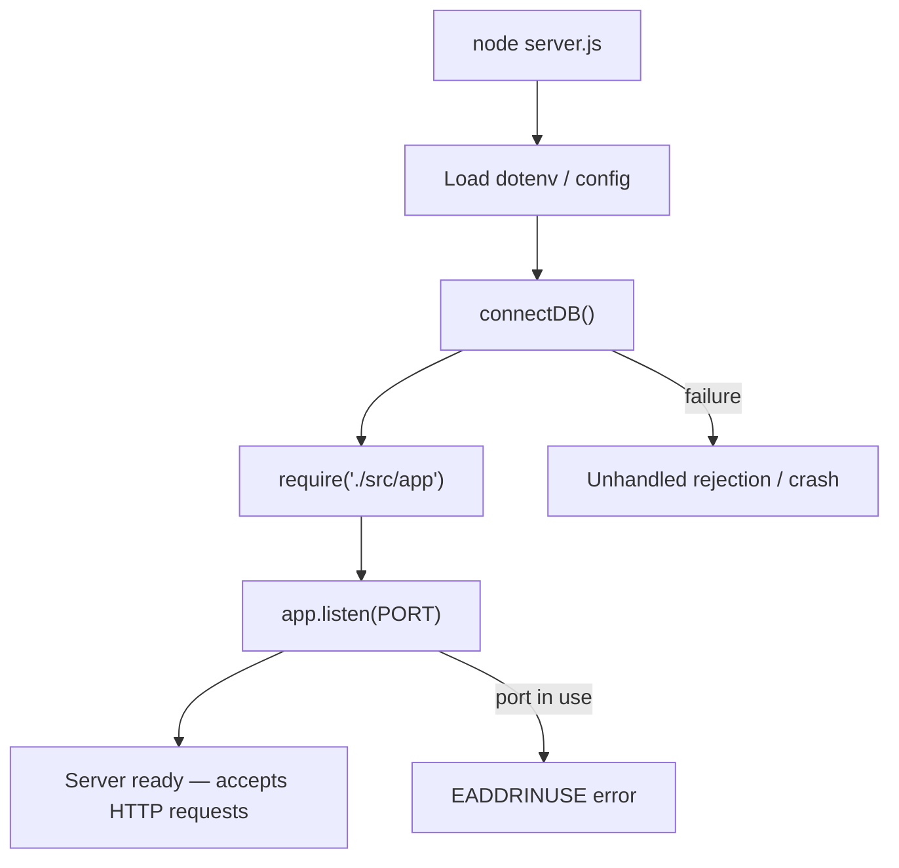

# Chapter 1: Project Bootstrap & Runtime Architecture

## Overview

Every backend you will ever ship starts the same way: an empty directory, a `package.json`, and a decision about how the process boots. Before you write a single route, authenticate a user, or query a database, you need a runtime shell — a Node.js process that loads configuration, connects to external services, creates an HTTP listener, and fails predictably when something goes wrong. This chapter is about building that shell correctly.

In professional backends, the bootstrap layer is deliberately thin. It does not contain business logic. Its job is to wire the environment, start the server, and hand control to an application object that Express (or another framework) manages. The e-commerce API you are studying follows this pattern: `server.js` owns process lifecycle concerns, while `src/app.js` owns HTTP application composition. Separating these two files is one of the earliest architectural decisions you will make, and it pays off the moment you need to test your app without listening on a port, or run database seeds without starting a web server.

Understanding bootstrap architecture also means understanding what runs *outside* Express. Database connections, environment variables, and unhandled promise rejections all live at the process level. If you get this layer wrong, every feature you build on top of it inherits the problem. This chapter teaches you to build the foundation from scratch, using the e-commerce project's `server.js`, `package.json`, and database connection module as your reference implementation.

## Learning Objectives

After completing this chapter, you will be able to:

1. **Explain** the separation of concerns between an entry point (`server.js`) and an application composition root (`src/app.js`).
2. **Initialize** a Node.js backend project with `npm`, configure scripts for development and production, and understand each dependency's role at bootstrap time.
3. **Implement** environment-based configuration using `dotenv` without committing secrets to version control.
4. **Connect** a Node.js process to MongoDB via Mongoose at startup and understand what happens when the connection fails.
5. **Design** graceful process-level error handling for unhandled promise rejections before Express middleware takes over.
6. **Trace** the exact boot sequence from `node server.js` to a listening HTTP server ready to accept requests.

## Prerequisites

### Handbook chapters

None — this is the first chapter.

### Knowledge

- JavaScript fundamentals: `require`, modules, `async`/`await`, promises
- Basic terminal usage: `cd`, `mkdir`, `npm` commands
- HTTP at a high level: what a server listening on a port means
- Familiarity with JSON and environment variables

### Local setup

- Node.js 18+ installed (`node -v` to verify)
- npm installed (`npm -v` to verify)
- A code editor and terminal
- MongoDB Atlas account (free tier is sufficient) — you will need a connection URI in a later step, but not to complete every exercise in this chapter

### Difficulty

Beginner

## Theory

### What "bootstrap" means in a backend

Bootstrap is everything that happens before your application handles its first HTTP request. In a Node.js + Express backend, the bootstrap phase includes:

1. **Process start** — Node.js loads your entry file (`server.js`).
2. **Configuration load** — Environment variables are read from the OS or a `.env` file.
3. **Dependency initialization** — Database drivers, caches, and other clients connect to external services.
4. **HTTP server creation** — Express app is created, middleware and routes are registered, and the process binds to a port.
5. **Ready state** — The process waits for incoming connections.

This sequence matters because steps 3 and 4 have different failure modes. A database connection failure should not leave a server listening on a port that cannot serve meaningful responses. A port-already-in-use error should exit cleanly with a useful message. Bootstrap is where you establish those contracts.



### The entry point vs the application object

A common beginner mistake is putting everything in one file: Express setup, routes, database connection, and `app.listen()` all together. That works for a 50-line tutorial. It breaks down quickly.

The professional pattern separates two responsibilities:

| File | Responsibility | Should it listen on a port? |
|---|---|---|
| **Entry point** (`server.js`) | Process lifecycle: load config, connect DB, start server, handle process-level errors | Yes — calls `app.listen()` |
| **Application** (`src/app.js`) | HTTP composition: middleware, route mounting, error handlers | No — exports `app` only |

Why export `app` without listening?

- **Testability** — Test runners can `require('./src/app')` and send synthetic HTTP requests with `supertest` without occupying a real port.
- **Flexibility** — Seed scripts and CLI tools can import database modules without starting a web server.
- **Clarity** — Anyone opening `server.js` immediately sees how the process starts. Anyone opening `app.js` immediately sees how HTTP is configured.

Think of `server.js` as the *launcher* and `app.js` as the *engine*.

### package.json as your project contract

`package.json` is more than a list of dependencies. It is the contract between your project and every environment that runs it — your laptop, a teammate's machine, a CI runner, a production server.

Key fields for bootstrap:

- **`name` / `version`** — Identity. Matters for publishing and internal tooling.
- **`main`** — Default entry when someone `require()`s your package. For an API, this is typically `server.js`.
- **`type`** — `"commonjs"` (default) uses `require()`. `"module"` uses `import`. This project uses CommonJS.
- **`scripts`** — Named commands that encode how to run your app. Never make teammates guess the start command.
- **`dependencies`** — Packages required at runtime in all environments.

Scripts deserve special attention. At minimum, every backend needs:

```json
"start": "node server.js",
"dev": "nodemon server.js"
```

`start` is what production process managers call. `dev` is what you run locally with auto-restart on file changes. Additional scripts (like seed commands) encode operational tasks as repeatable, documented commands rather than tribal knowledge.

### Environment configuration with dotenv

Hardcoding ports, database URIs, and API keys in source code is a security incident waiting to happen. The standard Node.js approach uses environment variables — key-value pairs injected into `process.env` by the operating system or a loader like `dotenv`.

`dotenv` reads a file (commonly `.env` or `config.env`) and populates `process.env` before your application code runs. The pattern:

```javascript
const dotenv = require("dotenv");
dotenv.config({ path: "config.env" });

const PORT = process.env.PORT;
```

Important rules:

- **Never commit secrets.** The config file goes in `.gitignore`.
- **Provide a template.** A `.env.example` with dummy values shows teammates what variables are required without exposing real credentials.
- **Load early.** Call `dotenv.config()` before any code that reads `process.env`.
- **Fail loudly on missing required vars.** If `PORT` is undefined, `app.listen(undefined)` behaves unexpectedly. Production systems validate required env vars at boot.

Environment variables also drive behavior differences between development and production — logging verbosity, error detail exposure, feature flags. In this project, `NODE_DEV=development` gates request logging via Morgan.

### Database connection at startup

MongoDB is an external service. Your Node.js process is a client. Mongoose is the ODM (Object Document Mapper) that manages the connection lifecycle.

The minimal connection pattern:

```javascript
const mongoose = require("mongoose");
const connectDB = () => mongoose.connect(process.env.DB_URI);
```

`mongoose.connect()` returns a Promise. In this project, the connection is fired without `await` at the top level of `server.js`. That is a deliberate simplicity trade-off for a learning project — Mongoose buffers operations until connected, so the server can start listening before the DB handshake completes. In production, you typically `await` the connection and exit if it fails, so you never serve traffic against a dead database.

Connection concerns at bootstrap:

- **Where does the URI live?** In an environment variable, never in source code.
- **Who calls connect?** The entry point, once, at startup — not per-request.
- **What happens on failure?** Without explicit handling, the rejection becomes an unhandled promise rejection (which this project's `server.js` catches at the process level).

### Process-level error handling

Express has its own error-handling middleware, but it only catches errors that occur *inside* the request-response cycle. Errors during bootstrap — failed DB connections, misconfigured env vars, port binding failures — happen outside Express.

Node.js emits `unhandledRejection` when a Promise rejects and no `.catch()` handles it. In older Node versions, the process continued running in a corrupted state. Modern Node terminates on unhandled rejections by default, but the exit is abrupt — no connection draining, no cleanup.

The production-minded pattern:

```javascript
process.on("unhandledRejection", (err) => {
  console.error("UNHANDLED REJECTION:", err);
  server.close(() => process.exit(1));
});
```

This gives in-flight HTTP requests a chance to finish before the process exits. It is a minimal version of graceful shutdown. A full implementation also handles `SIGTERM` (sent by deploy platforms and process managers) — that is covered in later chapters.

### CommonJS module system at boot

This project uses CommonJS (`require` / `module.exports`). At bootstrap, modules load synchronously in dependency order:

1. `server.js` requires `./src/app`
2. `app.js` requires Express, every route file, middleware, utilities
3. Each route file requires its service, which requires its model
4. The entire dependency tree evaluates before `app.listen()` runs

This matters because a syntax error or missing module in any file in the tree prevents the server from starting. It also means **side effects at the top level of required modules run at boot** — including multiple `dotenv.config()` calls in different files, which this project does.

## Real Project Implementation

### Files in scope

| File | Role |
|---|---|
| `package.json` | Project metadata, npm scripts, runtime dependencies |
| `server.js` | Process entry point: config, DB connect, listen, rejection handler |
| `src/app.js` | Express application composition (exported, not listened here) |
| `src/database/database.js` | Mongoose connection factory |
| `config.env` | Local environment variables (gitignored) |
| `.gitignore` | Excludes `node_modules`, `config.env`, `.env` from version control |

### How it works in this project

Follow the boot sequence as if you had just cloned an empty repo and built it step by step.

**Step 1 — Initialize the project.**

```bash
mkdir nodeJS-ecommerce && cd nodeJS-ecommerce
npm init -y
```

Edit `package.json` to set `"main": "server.js"` and add `start` / `dev` scripts. Install bootstrap dependencies:

```bash
npm install express dotenv mongoose morgan
npm install nodemon --save
```

Other dependencies (`bcrypt`, `stripe`, `multer`, etc.) are added as you build features in later chapters. Installing everything upfront (as this project does) is also valid — it front-loads setup so you are not interrupted mid-feature.

**Step 2 — Create the config file.**

Create `config.env` at the project root (same level as `server.js`):

```env
PORT=8000
NODE_DEV=development
BASE_URL=http://localhost:8000
DB_URI=mongodb+srv://<user>:<password>@<cluster>.mongodb.net/<dbname>?retryWrites=true&w=majority
SECRET_KEY=your_jwt_secret_here
JWT_EXPIRE=90d
```

Add `config.env` to `.gitignore`. Create a `.env.example` with the same keys and placeholder values for teammates.

**Step 3 — Create the database module.**

```javascript
// src/database/database.js
const mongoose = require("mongoose");
const dotenv = require("dotenv");

dotenv.config({ path: "config.env" });

const connectDB = () => mongoose.connect(process.env.DB_URI);

module.exports = connectDB;
```

This is a single-responsibility module: load config, export a function that connects. Nothing else.

**Step 4 — Create the application object.**

`src/app.js` creates and configures Express but does not call `listen()`. At this stage of building from scratch, your minimal `app.js` is:

```javascript
const express = require("express");
const dotenv = require("dotenv");

dotenv.config({ path: "config.env" });

const app = express();

app.use(express.json());

app.get("/health", (req, res) => {
  res.status(200).json({ status: "ok" });
});

module.exports = app;
```

The real project grows this file significantly — route imports, static file serving, error handlers — but the contract stays the same: **create, configure, export**.

**Step 5 — Create the entry point.**

```javascript
// server.js
const app = require("./src/app");
const connectDB = require("./src/database/database");
const dotenv = require("dotenv");

dotenv.config({ path: "config.env" });

const PORT = process.env.PORT;
connectDB();

const server = app.listen(PORT);

process.on("unhandledRejection", () => {
  server.close(() => {
    process.exit(1);
  });
});
```

Read this top to bottom — it is the boot contract:

1. Load environment variables.
2. Import the configured Express app (all routes and middleware are already attached).
3. Connect to MongoDB.
4. Start listening on `PORT`.
5. Register a process-level safety net for unhandled rejections.

**Step 6 — Run it.**

```bash
npm run dev
```

Nodemon watches files and restarts on change. You should see the server listening on port 8000 (or whatever `PORT` you set). At this point you have a running backend shell with no business features yet — exactly where you should be after Chapter 1.

### Key code

The `package.json` scripts encode how every environment starts the app:

```json
"scripts": {
  "test": "echo \"Error: no test specified\" && exit 1",
  "start": "node server.js",
  "dev": "nodemon server.js",
  "seed:insert": "node src/utils/dummyData/seeds/insertDummyProduct.js",
  "seed:delete": "node src/utils/dummyData/seeds/DeleteAllProducts.js"
}
```

Note that `nodemon` is listed under `dependencies` rather than `devDependencies`. It works, but it means production installs pull in a dev tool unnecessarily. A small improvement you will make in Exercise 2.

The application export contract in `app.js`:

```javascript
const app = express();
dotenv.config({ path: "config.env" });

// ... middleware, routes, error handlers ...

module.exports = app;
```

No `listen()` anywhere in this file. That is intentional and correct.

### Deviations in this codebase

- **`dotenv.config()` is called in three places** — `server.js`, `src/app.js`, and `src/database/database.js`. It works because dotenv does not overwrite existing `process.env` values, but it is redundant. A single call in `server.js` before any other import is cleaner.
- **`connectDB()` is not awaited and has no error handling** — the server starts listening even if MongoDB is unreachable. Acceptable for learning; risky for production.
- **`unhandledRejection` handler discards the error** — the callback takes no `err` parameter, so nothing is logged before exit. You cannot debug what went wrong.
- **No `.env.example` file** — new developers must discover required variables by reading the codebase or asking.
- **`nodemon` in `dependencies`** — should be in `devDependencies` to keep production installs lean.

## Best Practices

1. **Separate entry point from application object** — `server.js` listens; `app.js` exports. *In this project: follows.*

2. **Load environment variables once, as early as possible** — ideally the first lines of `server.js` before any other `require()`. *In this project: partial — loaded in three files.*

3. **Never commit secrets** — database URIs, API keys, and JWT secrets live in env files excluded by `.gitignore`. *In this project: follows for `config.env`, but no `.env.example` template exists.*

4. **Encode run commands in npm scripts** — `npm start` for production, `npm run dev` for local development. No undocumented `node` invocations. *In this project: follows.*

5. **Validate required environment variables at boot** — fail fast with a clear message if `PORT` or `DB_URI` is missing, rather than crashing mysteriously later. *In this project: missing.*

6. **Await database connection before accepting traffic** — ensure the DB is reachable before `app.listen()`. *In this project: missing — connection is fire-and-forget.*

7. **Log unhandled rejections with the error object** — always capture `err` in the handler so you have a stack trace. *In this project: missing — error is swallowed.*

8. **Use `devDependencies` for development-only tools** — `nodemon`, test runners, linters do not belong in production installs. *In this project: missing — `nodemon` is in `dependencies`.*

## Common Mistakes

1. **Putting `app.listen()` inside `app.js`** — Makes the app untestable and couples HTTP configuration to process lifecycle. **Fix:** Always listen in `server.js`; export `app` from `app.js`.

2. **Hardcoding the port** — `app.listen(8000)` breaks in production where the platform assigns a port via `process.env.PORT`. **Fix:** `const PORT = process.env.PORT || 3000`.

3. **Committing `config.env` to Git** — Even once. Secrets in Git history are effectively permanent. **Fix:** `.gitignore` the file from day one; use `.env.example` for documentation.

4. **Ignoring unhandled rejections** — A failed `mongoose.connect()` with no `.catch()` leaves the server running but every DB operation fails silently. **Fix:** Process-level handler + explicit connection error handling. *This project has the handler but does not log the error.*

5. **Installing all dependencies globally** — `npm install -g express` creates version drift across machines. **Fix:** Always install locally per project; lock versions with `package-lock.json`.

6. **Starting feature work before bootstrap is solid** — Adding routes before you have config, DB connection, and error handling means debugging three problems at once. **Fix:** Get `npm run dev` → server listening → DB connected before writing any business logic.

## Production Notes

### Configuration

In production, environment variables are injected by the hosting platform (Railway, Render, AWS, Docker, etc.) — not read from a `config.env` file on disk. Your code stays the same (`process.env.PORT`), but the source changes. Remove any dependency on a local file path for config loading, or keep `dotenv` gated:

```javascript
if (process.env.NODE_ENV !== "production") {
  dotenv.config({ path: "config.env" });
}
```

This project uses `NODE_DEV` instead of the conventional `NODE_ENV`. When deploying, ensure the platform sets the equivalent variable, or standardize on `NODE_ENV` during a refactor.

Required variables for this project at minimum: `PORT`, `DB_URI`, `SECRET_KEY`, `JWT_EXPIRE`, `BASE_URL`, `STRIPE_SECRET_KEY`, `STRIPE_SIGNING_SECRET`, `EMAIL_USER`, `EMAIL_PASSWORD`.

### Security & reliability

- **Secrets management** — Production uses a secrets manager (AWS Secrets Manager, Vault, platform env vars), not flat files. Rotate credentials if they were ever committed.
- **Graceful shutdown** — This project closes the server on unhandled rejection but does not handle `SIGTERM`/`SIGINT`. Deploy platforms send `SIGTERM` before killing a process. Without a handler, in-flight requests are cut mid-response.
- **Health checks** — Load balancers need an endpoint like `GET /health` to verify the process is alive. This project does not have one yet.
- **Connection resilience** — MongoDB connections drop. Production apps configure Mongoose reconnection options and monitor connection state.

### What this project is missing

- Environment variable validation at boot (e.g., with a small config module or a library like `envalid`)
- `await connectDB()` with explicit failure exit before `app.listen()`
- `SIGTERM` / `SIGINT` graceful shutdown handlers
- A `/health` endpoint for load balancer probes
- `.env.example` documenting required variables
- `dotenv` gated to non-production environments
- Structured logging instead of implicit crash-on-rejection
- `NODE_ENV` convention for environment detection

## Senior Engineer Notes

**Why not a single file?** For a 100-line tutorial API, one file is fine. For anything that grows past a few routes, the entry-point / application split is the cheapest architectural win available. It costs nothing at write time and unlocks testing, scripting, and multi-server deployment (HTTP + worker processes sharing the same `app` module) without refactoring.

**Trade-off: fire-and-forget DB connection.** This project calls `connectDB()` without awaiting. Mongoose buffers writes until connected, so the app appears to work. Under load or with a slow network, requests arrive before the connection is ready and fail unpredictably. The alternative — `await connectDB()` in an async `start()` function — adds 5 lines but guarantees the server never accepts traffic it cannot serve. For a Udemy learning project, the simpler version is tolerable. For production, it is not.

**Trade-off: multiple `dotenv.config()` calls.** Redundant but harmless because dotenv does not overwrite existing keys. The real cost is cognitive — a new developer cannot tell which file "owns" configuration. Consolidate to `server.js` and remove the other calls during a cleanup pass.

**When to break this pattern.** If you move to serverless (AWS Lambda, Cloudflare Workers), there is no long-running process, no `app.listen()`, and no `unhandledRejection` handler. The entry point / application split still helps (the handler imports `app`), but bootstrap concerns shift entirely to cold-start optimization and connection pooling via global scope reuse.

**Refactoring direction for this codebase.** Wrap boot in an async `start()` function in `server.js`:

```javascript
async function start() {
  dotenv.config({ path: "config.env" });
  validateEnv();
  await connectDB();
  const server = app.listen(process.env.PORT, () => {
    console.log(`Server running on port ${process.env.PORT}`);
  });
  setupGracefulShutdown(server);
}
start().catch((err) => {
  console.error("Failed to start:", err);
  process.exit(1);
});
```

This single change addresses four of the deviations listed above.

**Scale considerations.** At bootstrap, scale is irrelevant — one process, one port. Scale pressure appears later (connection pool sizing, clustering with `node:cluster` or PM2, read replicas). But bootstrap decisions enable or block scale: exporting `app` makes it trivial to run multiple worker processes behind a load balancer, each calling `app.listen()` on the same port via cluster mode.

## Interview Questions

### Conceptual

1. **Q:** Why do production Node.js backends separate the entry point from the Express application object?
   **A:**
   - Entry point owns process lifecycle (listen, shutdown, DB connect)
   - Application object owns HTTP configuration (middleware, routes)
   - Exporting `app` enables testing with `supertest` without a real port
   - Seed scripts and workers can import modules without starting HTTP
   - Clean separation of concerns as the codebase grows

2. **Q:** What is the difference between an error handled by Express error middleware and an unhandled promise rejection?
   **A:**
   - Express error middleware catches errors thrown or passed to `next(err)` inside the request-response cycle
   - Unhandled rejections occur outside that cycle — typically during bootstrap or background async work
   - Express middleware never sees them
   - Process-level handlers (`unhandledRejection`, `uncaughtException`) are the safety net
   - Production apps handle both layers

3. **Q:** Why should environment variables be used instead of hardcoded configuration?
   **A:**
   - Same code runs in dev, staging, and production with different config
   - Secrets are not committed to version control
   - Platform hosts inject vars without code changes
   - Enables 12-factor app compliance
   - Configuration can change without redeploying code (in some setups)

### Applied

4. **Q:** You run `node server.js` and see `EADDRINUSE: port 8000 already in use`. How do you diagnose and fix this?
   **A:**
   - Another process is already bound to port 8000 (likely a previous server instance)
   - Find it: `lsof -i :8000` or `ss -tlnp | grep 8000`
   - Kill the stale process or change `PORT` in `config.env`
   - Prevent recurrence: ensure graceful shutdown closes the server on exit
   - In production, the platform manages port assignment via `process.env.PORT`

5. **Q:** Your server starts and listens on the port, but every database operation fails. Walk through how you would debug this.
   **A:**
   - Check if `DB_URI` is set: log `process.env.DB_URI` (redact password) at boot
   - Check if `connectDB()` succeeded — this project does not await or log the result
   - Test the URI directly with `mongosh` or MongoDB Compass
   - Check Atlas IP whitelist (must include your machine's IP or `0.0.0.0/0` for dev)
   - Add explicit `await mongoose.connect()` with `.catch()` to surface the real error
   - Check Mongoose connection state: `mongoose.connection.readyState`

6. **Q:** A teammate suggests putting all routes, middleware, DB connection, and `app.listen()` in a single `index.js`. How do you respond?
   **A:**
   - It works for prototypes but creates problems as the project grows
   - Cannot test routes without starting a real server and occupying a port
   - Seed scripts and migrations would trigger HTTP server startup as a side effect
   - Process-level concerns (shutdown, DB) get mixed with HTTP concerns
   - Propose the split: `server.js` (boot) + `app.js` (HTTP) — cost is one extra file, benefit is permanent

## Exercises

### Exercise 1 — Guided

**Goal:** Trace the complete boot sequence of this project by reading code, without running anything.

**Constraints:** Read only `server.js`, `src/app.js`, `src/database/database.js`, and `package.json`. Do not modify any files.

**Success criteria:**
1. Write the boot sequence as a numbered list of at least 8 steps, from shell command to ready state.
2. Identify every file that calls `dotenv.config()` and note the line number.
3. Answer: which file calls `app.listen()` and why is it not in `app.js`?

### Exercise 2 — Implement

**Goal:** Harden the bootstrap layer with practices this project is missing.

**Constraints:** Modify only `server.js`, `package.json`, and create one new file. Do not change route or service files.

**Success criteria:**
1. Move `nodemon` to `devDependencies` in `package.json`.
2. Create `.env.example` with every required environment variable key and a placeholder value (no real secrets).
3. In `server.js`, log the rejection error in the `unhandledRejection` handler: `process.on("unhandledRejection", (err) => { ... })`.
4. Add a startup log after listen: `console.log(\`Server running on port ${PORT}\`)`.
5. `npm run dev` still starts the server successfully.

### Exercise 3 — Challenge

**Goal:** Refactor bootstrap into a production-ready async startup function.

**Constraints:** Modify `server.js` and `src/database/database.js`. You may create `src/config/validateEnv.js`. Do not modify `app.js` routes.

**Success criteria:**
1. `connectDB()` returns the Mongoose connection promise (it already does via `mongoose.connect()`).
2. `server.js` uses an `async function start()` that: loads dotenv → validates required env vars (`PORT`, `DB_URI`) → awaits DB connection → calls `app.listen()`.
3. If any step fails, log the error and `process.exit(1)` — the server must not listen on a port if the DB is unreachable.
4. Add `GET /health` in `app.js` (this one exception to the "don't modify routes" guidance is allowed) returning `{ status: "ok", db: mongoose.connection.readyState }`.
5. `curl http://localhost:8000/health` returns status ok with `db: 1` (connected).

## Summary

### Key takeaways

- Bootstrap is the phase before your app handles requests: load config, connect services, start listening.
- `server.js` owns process lifecycle; `src/app.js` owns HTTP composition and exports `app` without calling `listen()`.
- `package.json` scripts encode how every environment starts your server — `start` for production, `dev` for local.
- Environment variables keep secrets and environment-specific values out of source code; the config file must be gitignored.
- Process-level error handlers (`unhandledRejection`) catch failures that Express middleware never sees.
- Database connection belongs at startup in the entry point, and production systems await it before accepting traffic.

### Files to remember

`server.js`, `src/app.js`, `src/database/database.js`, `package.json`, `config.env`, `.gitignore`

You now have the runtime shell that every subsequent chapter builds upon — the next step is structuring the application layer that mounts inside it.

## Next Chapter Preview

**Next:** Chapter 2 — Express Application Structure & API Versioning

With a running server process, the next problem is organizing code so it does not collapse under its own weight after the tenth route. Chapter 2 teaches the feature-module pattern this project uses — route, service, and model per domain — along with API versioning (`/api/v1/...`) and nested routers for parent-child resources like categories and subcategories. You will learn why folder structure is an architecture decision, not a cosmetic one.
