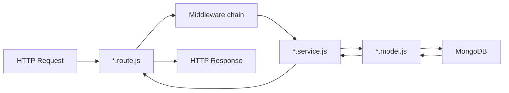
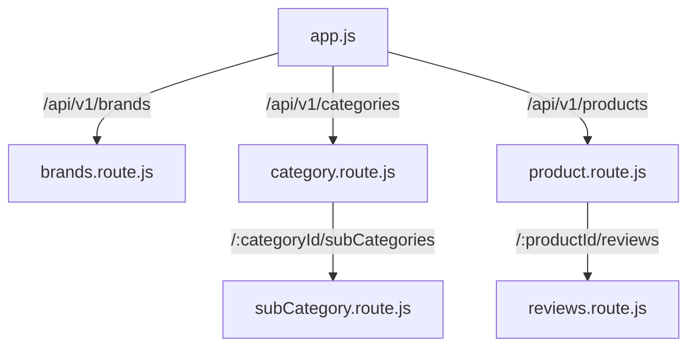

# Chapter 2: Express Application Structure & API Versioning

## Overview

Once your server boots and listens on a port, the next question is not "how do I handle a request?" — it is "where does that code live, and how do I keep it organized when there are fifty endpoints?" A backend without structure becomes a single file of doom: routes, database queries, validation, and auth logic tangled together, impossible to test, painful to change, and terrifying to onboard into.

Professional backends solve this with a **feature-module layout**: each business domain (brands, products, orders) gets its own folder with a predictable internal structure. A thin composition root (`src/app.js`) mounts each module under a versioned API prefix. Handlers stay small because they delegate to service functions, and services delegate to Mongoose models. This is the architecture this e-commerce project uses, and it scales from a Udemy course project to production systems serving millions of requests.

This chapter teaches you to build that structure from scratch. You will create your first complete feature module (brands), mount it with API versioning, then extend the pattern to nested parent-child resources (categories → subcategories, products → reviews). By the end, you will understand not just where files go, but why the separation between route, service, and model is one of the most important backend design decisions you will make.

## Learning Objectives

After completing this chapter, you will be able to:

1. **Design** a scalable folder layout for a REST API using the feature-module pattern (`route → service → model`).
2. **Implement** API versioning with a consistent `/api/v1/` prefix and mount domain routers in the application composition root.
3. **Build** a complete CRUD feature module from scratch and wire it into `src/app.js`.
4. **Configure** nested Express routers with `mergeParams` for parent-child resources.
5. **Apply** the handler factory pattern to eliminate repetitive CRUD code across modules.
6. **Evaluate** when to use nested routes versus flat top-level routes for the same resource.

## Prerequisites

### Handbook chapters

- Chapter 1: Project Bootstrap & Runtime Architecture

### Knowledge

- Express basics: `app`, `Router`, `app.use`, `app.get`
- HTTP methods and REST resource naming
- MongoDB/Mongoose schema basics (what a model is — deep schema design is Chapter 7)
- JavaScript module exports (`module.exports`, `require`)

### Local setup

- Chapter 1 bootstrap complete: `npm run dev` starts the server
- MongoDB connected via `DB_URI` in `config.env`
- `src/app.js` exists with `express.json()` middleware

### Difficulty

Beginner–Intermediate

## Theory

### Why folder structure is an architecture decision

Folder structure is not cosmetic. It encodes your team's mental model of the system. When a developer needs to add a "apply coupon to cart" feature, they should know immediately: the route goes in `cart.route.js`, the logic in `cart.service.js`, the schema in `cart.model.js`. No searching, no guessing, no accidentally putting business logic in a middleware file.

The alternative — a flat `routes/` folder, a flat `controllers/` folder, a flat `models/` folder — forces developers to jump between three directories to understand one feature. That works for 5 endpoints. At 50 endpoints, feature work becomes archaeology.

The **feature-module** (or **domain-module**) pattern colocates everything for one domain:

```
src/modules/brands/
  brands.route.js      ← HTTP layer: URLs, methods, middleware chain
  brands.service.js    ← Business logic: what to do
  brands.model.js      ← Data layer: schema and persistence
  brands.validation.js ← Input validation (added in Chapter 5)
  brand.upload.js      ← File upload (added in Chapter 16)
```

Each file has one job. Routes never touch the database directly. Models never know about HTTP status codes. Services are the bridge.



### The three layers and their contracts

| Layer | File suffix | Knows about | Must NOT know about |
|---|---|---|---|
| **Route** | `*.route.js` | HTTP (methods, params, middleware order) | Mongoose query syntax |
| **Service** | `*.service.js` | Business rules, orchestration | `req`/`res` objects (ideally) |
| **Model** | `*.model.js` | Schema, validation, DB hooks | HTTP status codes |

**Route layer** — Defines which URL + method maps to which handler. Attaches middleware (auth, validation, upload) in the correct order. Exports an Express `Router`.

**Service layer** — Contains the actual work. In simple modules, services are thin wrappers around factory functions. In complex modules (cart, orders), services contain multi-step business logic. Services receive data from routes (usually via `req.body`, `req.params`, `req.user`) and return results or call `next(error)`.

**Model layer** — Defines the Mongoose schema: field types, required flags, references to other collections, indexes, and hooks. This is the contract with the database.

### Express Router and route mounting

Express `Router` is a mini-application. It has its own middleware and routes but no port. You mount it on the main `app` with a path prefix:

```javascript
const brandRouter = require("./modules/brands/brands.route");
app.use("/api/v1/brands", brandRouter);
```

Now every route inside `brandRouter` is prefixed with `/api/v1/brands`. A `router.get("/")` becomes `GET /api/v1/brands`. A `router.get("/:id")` becomes `GET /api/v1/brands/:id`.

Mounting is how `app.js` stays thin. It does not define individual endpoints — it imports routers and attaches prefixes. All feature knowledge lives in modules.



### API versioning

APIs change. Fields get renamed, response shapes evolve, endpoints get removed. If you ship breaking changes to the same URLs, every mobile app and frontend client breaks simultaneously.

Versioning isolates breaking changes behind a new prefix:

```
/api/v1/products   ← current clients
/api/v2/products   ← new clients, new shape
```

This project uses **URL path versioning** with a `v1` segment. Every mount in `app.js` uses `/api/v1/...`. When you need `v2`, you duplicate or refactor modules and mount them at `/api/v2/...` while keeping `v1` alive for existing clients.

Rules for versioning:

- **Version at the API boundary** — `/api/v1/`, not per-route (`/api/products/v1`)
- **Never break v1** — add v2 for breaking changes; deprecate v1 with a timeline
- **Keep versions in the composition root** — `app.js` is the version map; modules stay version-agnostic
- **Consistent plural nouns** — `/brands`, `/products`, `/categories` (not `/brand`, `/product`)

### RESTful route conventions inside a module

Within each mounted router, follow standard REST patterns:

| Intent | Method | Path (relative to mount) | Example full URL |
|---|---|---|---|
| List all | `GET` | `/` | `GET /api/v1/brands` |
| Create | `POST` | `/` | `POST /api/v1/brands` |
| Get one | `GET` | `/:id` | `GET /api/v1/brands/64abc...` |
| Update | `PUT` | `/:id` | `PUT /api/v1/brands/64abc...` |
| Delete | `DELETE` | `/:id` | `DELETE /api/v1/brands/64abc...` |

Express `router.route()` chains methods on the same path:

```javascript
router
  .route("/")
  .get(getAllBrands)
  .post(protectRoutes, allowedTo("admin"), createBrandValidation, createBrand);

router
  .route("/:id")
  .get(getSingleBrand)
  .put(protectRoutes, allowedTo("admin"), updateBrand)
  .delete(protectRoutes, allowedTo("admin"), deleteBrand);
```

This is cleaner than separate `router.get("/", ...)` and `router.post("/", ...)` calls because it documents the resource's supported methods in one block.

### Nested routers and mergeParams

Some resources naturally belong under a parent:

```
/api/v1/categories/:categoryId/subCategories
/api/v1/products/:productId/reviews
```

Express supports this by mounting a child router on a parent router:

```javascript
// In category.route.js
router.use("/:categoryId/subCategories", subCategoryRoute);
```

The child router (`subCategory.route.js`) must use `{ mergeParams: true }`:

```javascript
const router = express.Router({ mergeParams: true });
```

Without `mergeParams`, the child router cannot access `:categoryId` from the parent mount. With it, `req.params.categoryId` is available inside subcategory handlers — essential for filtering and auto-setting the parent FK on create.

Nested routing also requires small **middleware bridges** in the service layer:

- `createFilterObj` — reads `req.params.categoryId` and sets `req.filterObj` so `getAll` returns only that category's subcategories
- `setCategoryIdToBody` — injects `req.params.categoryId` into `req.body.category` on create, so the client does not need to send the parent ID in the body

### The handler factory — shared CRUD without copy-paste

Many modules in this project are standard CRUD: create, read, update, delete. Writing the same Mongoose calls in every service file violates DRY. The project centralizes repeated patterns in `src/services/handlerFactory.js`:

```javascript
exports.createOne = (model) => expressAsyncHandler(async (req, res) => {
  const document = await model.create(req.body);
  res.status(201).json({ message: "data created successfully", data: document });
});
```

A service file becomes a one-liner per operation:

```javascript
exports.createBrand = createOne(BrandModel);
exports.getAllBrands = getAll(BrandModel);
exports.getSingleBrand = getOne(BrandModel);
exports.updateBrand = updateOne(BrandModel);
exports.deleteBrand = deleteOne(BrandModel);
```

The factory is not magic — it is a higher-order function that returns an Express-compatible async handler. When a module needs custom logic (cart totals, order stock decrements), it writes its own service function instead of using the factory. The factory handles the 80% case; bespoke services handle the 20%.

### Flat vs nested vs dual-mounted routes

This project mounts subcategories and reviews in **two ways**:

1. **Nested** — `/api/v1/categories/:categoryId/subCategories` and `/api/v1/products/:productId/reviews`
2. **Flat** — `/api/v1/subCategories` and `/api/v1/reviews` (also mounted in `app.js`)

Dual mounting is a pragmatic choice: nested routes express the relationship; flat routes allow admin queries across all subcategories or reviews without knowing a parent ID. The trade-off is maintenance — two entry points to the same router logic. A stricter design picks one canonical path and documents it.

## Real Project Implementation

### Files in scope

| File | Role |
|---|---|
| `src/app.js` | Composition root: imports and mounts all domain routers under `/api/v1/` |
| `src/modules/brands/brands.model.js` | Brand Mongoose schema |
| `src/modules/brands/brands.service.js` | Brand handlers via handlerFactory |
| `src/modules/brands/brands.route.js` | Brand HTTP routes and middleware chain |
| `src/modules/category/category.route.js` | Category routes + nested subcategory mount |
| `src/modules/subCategory/subCategory.route.js` | Subcategory routes with `mergeParams` |
| `src/modules/subCategory/subCategory.service.js` | Filter/body bridge middleware + factory CRUD |
| `src/modules/product/product.route.js` | Product routes + nested reviews mount |
| `src/modules/reviews/reviews.route.js` | Review routes with `mergeParams` |
| `src/services/handlerFactory.js` | Shared CRUD handler factory |

### How it works in this project

Build the structure incrementally, the same way this project evolved.

**Step 1 — Create the folder skeleton.**

```bash
mkdir -p src/modules/brands
mkdir -p src/services
mkdir -p src/middlewares
mkdir -p src/utils
```

Every new domain you add later follows the same `src/modules/<domain>/` pattern.

**Step 2 — Build the model (data layer first).**

Start with the schema because routes and services depend on it. Create `src/modules/brands/brands.model.js`:

```javascript
const mongoose = require("mongoose");
const Schema = mongoose.Schema;

const brandSchema = new Schema(
  {
    name: {
      type: String,
      required: [true, "Brand name is required"],
      unique: true,
      minlength: 3,
      maxlength: 50,
    },
    slug: { type: String },
    image: String,
  },
  { timestamps: true },
);

module.exports = mongoose.model("Brand", brandSchema);
```

**Step 3 — Build the service (business layer).**

Create `src/services/handlerFactory.js` with the shared `createOne`, `getAll`, `getOne`, `updateOne`, `deleteOne` functions (full implementation in the project). Then create `src/modules/brands/brands.service.js`:

```javascript
const BrandModel = require("./brands.model");
const { createOne, getAll, getOne, updateOne, deleteOne } =
  require("../../services/handlerFactory");

exports.createBrand = createOne(BrandModel);
exports.getAllBrands = getAll(BrandModel);
exports.getSingleBrand = getOne(BrandModel);
exports.updateBrand = updateOne(BrandModel);
exports.deleteBrand = deleteOne(BrandModel);
```

Five endpoints, five one-liners. The factory owns the Mongoose calls and response shapes.

**Step 4 — Build the route (HTTP layer).**

Create `src/modules/brands/brands.route.js`:

```javascript
const express = require("express");
const {
  createBrand,
  getAllBrands,
  getSingleBrand,
  updateBrand,
  deleteBrand,
} = require("./brands.service");

const router = express.Router();

router.route("/").get(getAllBrands).post(createBrand);
router.route("/:id").get(getSingleBrand).put(updateBrand).delete(deleteBrand);

module.exports = router;
```

At this stage, skip auth and validation — add them in later chapters. The goal is a working CRUD loop.

**Step 5 — Mount in the composition root.**

In `src/app.js`, import and mount:

```javascript
const brandsRouter = require("./modules/brands/brands.route");

app.use("/api/v1/brands", brandsRouter);
```

**Step 6 — Test the module.**

```bash
# Create
curl -X POST http://localhost:8000/api/v1/brands \
  -H "Content-Type: application/json" \
  -d '{"name": "Nike", "slug": "nike"}'

# List
curl http://localhost:8000/api/v1/brands

# Get one
curl http://localhost:8000/api/v1/brands/<id>
```

Repeat this six-step cycle for every new domain: model → service → route → mount → test.

**Step 7 — Add nested routing (categories → subcategories).**

In `category.route.js`, import the subcategory router and mount it **before** the `/:id` routes (order matters — Express matches top to bottom):

```19:19:nodeJS-ecommerce/src/modules/category/category.route.js
router.use("/:categoryId/subCategories", subCategoryRoute);
```

In `subCategory.route.js`, enable param merging:

```18:18:nodeJS-ecommerce/src/modules/subCategory/subCategory.route.js
const router = express.Router({ mergeParams: true });
```

Add bridge middleware in `subCategory.service.js`:

```10:16:nodeJS-ecommerce/src/modules/subCategory/subCategory.service.js
exports.createFilterObj = (req, res, next) => {
  const filterObj = {};
  if (req.params.categoryId) filterObj.category = req.params.categoryId;

  req.filterObj = filterObj;
  next();
};
```

```20:23:nodeJS-ecommerce/src/modules/subCategory/subCategory.service.js
exports.setCategoryIdToBody = (req, res, next) => {
  if (!req.body.category) req.body.category = req.params.categoryId;
  next();
};
```

Now `GET /api/v1/categories/64abc/subCategories` returns only subcategories for that category, and `POST` to the same path auto-sets the parent FK.

**Step 8 — Replicate for products → reviews.**

The pattern is identical. In `product.route.js`:

```20:20:nodeJS-ecommerce/src/modules/product/product.route.js
router.use("/:productId/reviews", reviewRouter);
```

In `reviews.route.js`:

```18:18:nodeJS-ecommerce/src/modules/reviews/reviews.route.js
const router = express.Router({ mergeParams: true });
```

### Key code

The full mount map in the composition root — this is the API's public surface:

```39:50:nodeJS-ecommerce/src/app.js
app.use("/api/v1/categories", categoryRouter);
app.use("/api/v1/subCategories", subCategoryRouter);
app.use("/api/v1/brands", brandsRouter);
app.use("/api/v1/products", productRouter);
app.use("/api/v1/users", userRouter);
app.use("/api/v1/auth", authRouter);
app.use("/api/v1/reviews", reviewRouter);
app.use("/api/v1/wishlist", wishlistRouter);
app.use("/api/v1/userAddress", userAddressRouter);
app.use("/api/v1/coupons", couponRouter);
app.use("/api/v1/cart", cartRouter);
app.use("/api/v1/orders", orderRouter);
```

A standard factory-backed service — the simplest module shape in the project:

```1:17:nodeJS-ecommerce/src/modules/brands/brands.service.js
const BrandModel = require("./brands.model");
const {
  deleteOne,
  updateOne,
  createOne,
  getOne,
  getAll,
} = require("../../services/handlerFactory");

exports.createBrand = createOne(BrandModel);

exports.getAllBrands = getAll(BrandModel);

exports.getSingleBrand = getOne(BrandModel);
exports.updateBrand = updateOne(BrandModel);

exports.deleteBrand = deleteOne(BrandModel);
```

### Deviations in this codebase

- **Dual mounting for subcategories and reviews** — both nested and flat top-level routes exist. Works, but can confuse API consumers about the canonical path.
- **`reviewRouter` imported in `app.js` but primary usage is nested under products** — the flat `/api/v1/reviews` mount is a secondary entry point with no parent filter by default.
- **Route mount order in `category.route.js`** — nested subcategory router is mounted before `/:id` routes, which is correct. Getting this wrong would cause Express to treat the string `subCategories` as an `:id` param.
- **Inconsistent file naming** — most modules use `category.route.js` but orders uses `orders.route.js` (plural mismatch with `order.model.js` / `order.service.js`).
- **`handlerFactory.getAll` ignores the `filter` argument** — it builds `filter` from `req.filterObj` but passes an unfiltered query to `ApiFeature` (fixed in Chapter 10).
- **Auth and validation mixed into routes early** — correct placement, but makes the brand route file longer before you understand the layers. Build without them first, then layer on.

## Best Practices

1. **One folder per domain, predictable file names** — `*.route.js`, `*.service.js`, `*.model.js` in every module. *In this project: follows.*

2. **Mount all routers in one place** — `app.js` is the single map of API surface area. Never mount routers inside other modules except for intentional nesting. *In this project: follows.*

3. **Version at `/api/v1/`** — all public endpoints share a version prefix. *In this project: follows.*

4. **Use `router.route()` for RESTful path grouping** — documents supported methods per resource path. *In this project: follows.*

5. **Use `{ mergeParams: true }` on nested child routers** — without it, parent route params are invisible to child handlers. *In this project: follows for subcategories and reviews.*

6. **Mount specific paths before parameterized paths** — `/:categoryId/subCategories` before `/:id`, or Express misroutes. *In this project: follows in category.route.js.*

7. **Keep `app.js` free of endpoint logic** — only middleware, mounts, 404 catch-all, and error handler. *In this project: mostly follows — webhook route is an exception.*

8. **Extract repeated CRUD into a factory** — but override with custom services when business logic diverges. *In this project: follows.*

## Common Mistakes

1. **Putting database queries in route files** — Routes become untestable and bloated. **Fix:** Route calls service; service calls model.

2. **Forgetting `mergeParams: true` on nested routers** — `req.params.categoryId` is `undefined` in the child router; filters and FK injection silently fail. **Fix:** Always set `{ mergeParams: true }` on child routers.

3. **Mounting `/:id` routes before static path segments** — `GET /categories/subCategories` gets captured by `GET /categories/:id` with `id = "subCategories"`. **Fix:** Mount nested routers and static paths before parameterized catch-alls.

4. **Inconsistent pluralization** — `/api/v1/brand` mixed with `/api/v1/products` confuses clients and breaks convention. **Fix:** Always plural nouns for collection resources.

5. **No API versioning from day one** — Adding `/v1/` later means breaking every client URL or maintaining two parallel mount trees. **Fix:** Start with `/api/v1/` even if v2 is years away.

6. **Giant monolithic `routes.js`** — One file with every endpoint works until it does not. **Fix:** Feature modules from the second or third endpoint onward. *This project avoids this by using modules from the start.*

## Production Notes

### Configuration

API structure itself is not environment-specific, but the composition root may conditionally mount routes:

```javascript
if (process.env.ENABLE_ADMIN_ROUTES === "true") {
  app.use("/api/v1/admin", adminRouter);
}
```

This project mounts all routes unconditionally. In production, consider feature flags for beta endpoints or internal-only admin mounts behind a separate prefix or network rule.

### Security & reliability

- **Route exposure audit** — Every mount in `app.js` is a public entry point. Review which routes have `protectRoutes` and `allowedTo` before deploying. An unprotected `POST` on a catalog resource is an open write endpoint.
- **Rate limiting per route group** — Different domains have different abuse profiles. Login (`/auth`) needs stricter limits than catalog reads (`/products`). Not implemented in this project yet.
- **Nested route param validation** — `:categoryId` and `:productId` in URLs should be validated as valid MongoDB ObjectIds before hitting the database. Partially done via validators in later chapters; not universal on nested list endpoints.
- **404 vs 405** — This project returns 400 for unknown routes (via catch-all `ApiError`). Production APIs typically return 404 for unknown paths and 405 for known paths with unsupported methods.

### What this project is missing

- A single API contract document (OpenAPI/Swagger) generated from or describing the mount map
- Consistent naming (`orders.route.js` vs `order.model.js`)
- Route-level rate limiting
- Conditional route mounting for environment-specific features
- Canonical path policy for dual-mounted resources (nested vs flat)
- A `v2` versioning strategy document or placeholder mount

## Senior Engineer Notes

**Why feature modules over layered folders?** Layered architecture (`/routes`, `/controllers`, `/models`) optimizes for role-based navigation ("I work on controllers today"). Feature modules optimize for domain-based work ("I work on orders today"). Backend teams typically organize sprints around features, not layers. Feature modules reduce context-switching and make ownership boundaries clear — the orders module can be reviewed, tested, and eventually extracted into a microservice as a unit.

**Trade-off: handler factory.** The factory accelerates CRUD modules (brands, categories, coupons) but creates hidden coupling. New developers must read `handlerFactory.js` to understand what `createBrand` actually does. It also encourages passing `req.body` directly to `model.create()` without sanitization — acceptable when validation middleware runs first, dangerous when it does not. Rule of thumb: use the factory for admin-managed reference data with validation; write custom services for anything involving money, inventory, or multi-document transactions.

**Trade-off: dual-mounted routers.** Mounting subcategories at both `/categories/:id/subCategories` and `/subCategories` gives flexibility but doubles the API surface to maintain and document. For a public API, pick one canonical path and redirect or deprecate the other. For an internal API where admin panels need global queries and product pages need nested queries, dual mounting is pragmatic.

**When to break the three-layer pattern.** Extremely simple proxies or health-check endpoints can live as inline handlers in `app.js`. Background workers and CLI scripts can import services directly, skipping routes entirely. Microservice extraction splits a module into its own repo — the internal structure (route/service/model) stays, but the mount moves to a separate process.

**Refactoring direction for this codebase.** Create a `src/routes/index.js` (or `src/routes/v1.js`) that owns all mounts, leaving `app.js` with only global middleware:

```javascript
// src/routes/v1.js
const router = express.Router();
router.use("/brands", brandsRouter);
router.use("/categories", categoryRouter);
// ...
module.exports = router;

// app.js
app.use("/api/v1", v1Router);
```

This reduces `app.js` to middleware + `app.use("/api/v1", v1Router)` + error handling, and makes adding `v2` a one-line change.

**Scale considerations.** Feature modules do not directly affect runtime performance — Express routing is in-memory and fast. Scale impact is organizational: with 15 modules and 5 engineers, module boundaries prevent merge conflicts and allow parallel feature development. The first performance bottleneck will be database queries (Chapter 10), not route structure.

## Interview Questions

### Conceptual

1. **Q:** What are the responsibilities of the route, service, and model layers in a Node.js backend?
   **A:**
   - Route: HTTP mapping, middleware chain, no DB logic
   - Service: business logic, orchestration, calls models
   - Model: schema definition, persistence, DB-level hooks
   - Routes receive requests and delegate; models know nothing about HTTP
   - Separation enables independent testing of each layer

2. **Q:** Why do APIs use URL path versioning like `/api/v1/`?
   **A:**
   - Allows breaking changes in v2 without breaking existing clients
   - Clients opt in to new versions on their own timeline
   - Version at the API boundary, not per-resource
   - Old versions can be deprecated and sunset with notice
   - Alternative strategies (header versioning, query param) exist but URL versioning is most visible and common

3. **Q:** What does `mergeParams: true` do on an Express Router and when do you need it?
   **A:**
   - By default, child routers do not inherit parent route params
   - `mergeParams: true` merges parent params into `req.params` of the child
   - Required for nested mounts like `/:categoryId/subCategories`
   - Without it, `req.params.categoryId` is undefined in child handlers
   - Only needed on child routers, not the parent

### Applied

4. **Q:** You need to add a `taxes` module with full CRUD. Walk through the files you would create and where you would wire it.
   **A:**
   - Create `src/modules/taxes/taxes.model.js` — schema
   - Create `src/modules/taxes/taxes.service.js` — factory-backed or custom handlers
   - Create `src/modules/taxes/taxes.route.js` — REST routes
   - Import router in `app.js` (or `routes/v1.js`)
   - Mount: `app.use("/api/v1/taxes", taxesRouter)`
   - Test with curl/Postman: GET list, POST create, GET by id
   - Add validation and auth middleware in route file (later chapters)

5. **Q:** `GET /api/v1/categories/subCategories` returns a category with id "subCategories" instead of listing subcategories. What went wrong?
   **A:**
   - The `/:id` route is mounted before the nested subcategory router
   - Express matches `subCategories` as the `:id` param value
   - Fix: mount `router.use("/:categoryId/subCategories", subCategoryRoute)` before `router.route("/:id")`
   - Route order in Express is first-match-wins
   - Verify with logging `req.params` in the handler

6. **Q:** A teammate wants to put all CRUD logic directly in route handlers to reduce file count. How do you push back?
   **A:**
   - Routes with DB logic cannot be unit-tested without HTTP mocking
   - Business logic in routes cannot be reused by seed scripts, workers, or CLI tools
   - File count is not the right metric — separation of concerns is
   - Factory pattern already minimizes service file size for simple CRUD
   - Propose: keep three files, use factory for simple modules — net ~15 lines per layer

## Exercises

### Exercise 1 — Guided

**Goal:** Map the complete API surface of this project by reading `src/app.js` and route files only.

**Constraints:** Do not run the server. Read `src/app.js`, `brands.route.js`, `category.route.js`, `subCategory.route.js`, `product.route.js`, and `reviews.route.js`.

**Success criteria:**
1. Produce a table with columns: `Method`, `Full URL`, `Module`, `Public or Protected`.
2. List at least 10 endpoints.
3. Identify which routes are nested and which are flat-mounted.
4. Explain why `subCategory.route.js` uses `{ mergeParams: true }`.

### Exercise 2 — Implement

**Goal:** Build a new `suppliers` module from scratch using the same three-layer pattern as brands.

**Constraints:** Follow the exact file naming convention. Use `handlerFactory` for all CRUD. Mount under `/api/v1/suppliers`.

**Success criteria:**
1. `src/modules/suppliers/suppliers.model.js` — schema with `name` (required, unique), `slug`, `country`.
2. `src/modules/suppliers/suppliers.service.js` — five factory-backed exports.
3. `src/modules/suppliers/suppliers.route.js` — full REST routes (no auth yet).
4. Mounted in `src/app.js`.
5. `POST /api/v1/suppliers` creates a record; `GET /api/v1/suppliers` returns it.

### Exercise 3 — Challenge

**Goal:** Add nested routing for suppliers under brands: `/api/v1/brands/:brandId/suppliers`.

**Constraints:** Create `src/modules/suppliers/suppliers.route.js` with `mergeParams`. Do not break the existing flat `/api/v1/suppliers` mount. Reuse the same service functions.

**Success criteria:**
1. `GET /api/v1/brands/:brandId/suppliers` returns only suppliers for that brand (add `brand` field to schema, `createFilterObj` middleware).
2. `POST /api/v1/brands/:brandId/suppliers` auto-sets `brand` from params (add `setBrandIdToBody` middleware).
3. `GET /api/v1/suppliers` still returns all suppliers (flat mount still works).
4. Nested router mounted **before** `/:id` in `brands.route.js`.
5. Document both URL patterns in a comment at the top of `suppliers.route.js`.

## Summary

### Key takeaways

- Feature modules colocate route, service, and model per domain — folder structure is an architecture decision, not a style choice.
- `src/app.js` is the composition root: global middleware, versioned router mounts, 404 catch-all, error handler — no business logic.
- API versioning via `/api/v1/` protects clients from breaking changes when the API evolves.
- Nested routers need `{ mergeParams: true }` and bridge middleware to pass parent IDs into filters and request bodies.
- The handler factory eliminates repetitive CRUD across simple modules; custom services handle complex domain logic.
- Mount order matters: nested and static paths before parameterized `/:id` routes.

### Files to remember

`src/app.js`, `src/modules/brands/brands.route.js`, `src/modules/brands/brands.service.js`, `src/modules/brands/brands.model.js`, `src/services/handlerFactory.js`, `src/modules/category/category.route.js`, `src/modules/subCategory/subCategory.route.js`

With modules mounted and organized, the next layer to master is how a single HTTP request flows through middleware before it ever reaches your route handler.

## Next Chapter Preview

**Next:** Chapter 3 — The Request Lifecycle & Middleware Chain

You have routes and modules, but a request does not jump straight from URL to service. It passes through a chain of middleware — body parsers, static file handlers, authentication, validation, and error handlers — each transforming the request or short-circuiting the response. Chapter 3 traces that full lifecycle using this project's `app.js` middleware stack, explains why the Stripe webhook is registered before `express.json()`, and teaches you to reason about middleware order as a first-class design problem.
