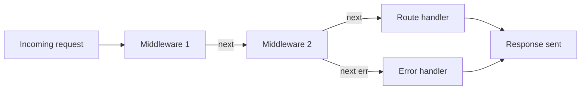
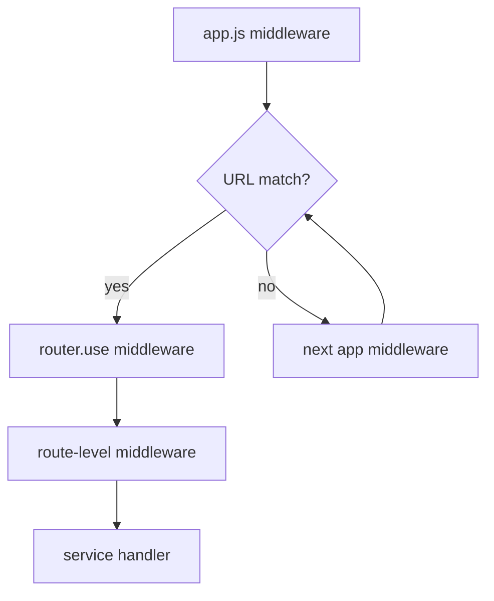

# Chapter 3: The Request Lifecycle & Middleware Chain

## Overview

A URL hitting your server does not go straight to a handler function. It passes through a pipeline — a chain of middleware functions, each with a chance to read the request, modify it, reject it, or pass control forward. Getting this chain right is one of the most practical skills in backend engineering. Wrong order means parsed bodies arrive empty, webhooks fail signature verification, auth runs after business logic, or errors never reach your global handler.

This chapter teaches you to think in pipelines. You will trace a real request through this e-commerce API from the moment it enters `src/app.js` to the moment a JSON response leaves (or an error is caught). You will learn the three scopes where middleware attaches — application, router, and route — and why the Stripe webhook in this project is registered *before* `express.json()`. That single ordering decision is the difference between a working payment flow and silent payment failures.

By the end, middleware will not be a mystery wrapper around routes. It will be a deliberate design tool you use to enforce security, parse input, log traffic, and centralize error handling — before any service function runs.

## Learning Objectives

After completing this chapter, you will be able to:

1. **Trace** a complete HTTP request from ingress through middleware, route handlers, and back out as a response or error.
2. **Explain** how Express middleware chaining works via the `next` function and why order is not arbitrary.
3. **Distinguish** between application-level, router-level, and route-level middleware and choose the correct scope.
4. **Configure** body parsers correctly for JSON APIs and raw webhook payloads on the same application.
5. **Implement** async error propagation using `express-async-handler` and a global error-handling middleware.
6. **Design** a catch-all 404 handler and terminal error handler that sit after all routes in `app.js`.

## Prerequisites

### Handbook chapters

- Chapter 1: Project Bootstrap & Runtime Architecture
- Chapter 2: Express Application Structure & API Versioning

### Knowledge

- Express `Router` and route mounting (Chapter 2)
- HTTP request structure: headers, body, method, URL
- JavaScript promises and `async`/`await`
- Basic understanding of JWT Bearer tokens (deep dive in Chapter 12)

### Local setup

- Server running with `npm run dev`
- At least one public route working (e.g., `GET /api/v1/brands`)
- `config.env` with valid `SECRET_KEY` if testing protected routes

### Difficulty

Beginner–Intermediate

## Theory

### What middleware is

Middleware is a function with the signature `(req, res, next)`. It runs after the server receives a request and before the final route handler sends a response. Each middleware can:

- **Read** the request (`req.headers`, `req.body`, `req.params`)
- **Modify** the request (attach `req.user` after auth, set `req.filterObj`)
- **End** the response (`res.status(200).json(...)`) — no further middleware runs
- **Pass control** by calling `next()` — the next middleware in the chain runs
- **Pass an error** by calling `next(err)` — Express skips to error-handling middleware



Middleware is not optional infrastructure. In this project, every protected route depends on `protectRoutes` middleware running before the service handler. Every POST with a JSON body depends on `express.json()` running first. The pipeline *is* the request lifecycle.

### The three scopes of middleware

Middleware can attach at three levels. The scope determines which requests it affects.

| Scope | Attached via | Affects | Example in this project |
|---|---|---|---|
| **Application** | `app.use(...)` in `app.js` | Every request hitting the app | `express.json()`, `morgan`, 404 catch-all |
| **Router** | `router.use(...)` in `*.route.js` | Every request on that router's mount path | `router.use(protectRoutes)` on cart router |
| **Route** | Inline in `router.get/post/put/delete` | Only that specific method + path | `allowedTo("admin")` on a single POST |

Application middleware runs first for all requests. Then Express matches the URL to a mounted router. Router-level middleware runs for all routes on that router. Route-level middleware runs only for the matched route, in the order listed.



### Middleware order is logic, not convention

Express executes middleware in registration order. The order you write `app.use()` calls in `app.js` is the order they run. This is not stylistic — it is functional.

Critical rules:

1. **Body parsers before routes that read `req.body`** — `express.json()` must run before any POST handler.
2. **Special parsers before general parsers** — raw body routes before `express.json()`, because `express.json()` consumes the body stream.
3. **Auth before business logic** — `protectRoutes` before the handler that uses `req.user`.
4. **Routes before 404 catch-all** — the catch-all must be registered after every real route.
5. **404 catch-all before error handler** — error middleware is always last.

Getting rule 2 wrong is the most common production bug. Stripe webhook signature verification requires the **raw** request body (a Buffer). If `express.json()` runs first, it parses the body into a JavaScript object and the raw bytes are gone forever. Signature verification fails. This is why this project registers the webhook route before `express.json()`.

### Body parsing: json vs raw

| Parser | Middleware | `req.body` type | Use case |
|---|---|---|---|
| JSON | `express.json()` | JavaScript object | REST API endpoints |
| Raw | `express.raw({ type: "application/json" })` | Buffer | Webhook signature verification |
| URL-encoded | `express.urlencoded({ extended: true })` | JavaScript object | HTML form submissions |

For this project, almost every route uses JSON. One route — the Stripe webhook — needs raw. The pattern:

```javascript
// 1. Raw route FIRST — only this path gets raw parsing
app.post("/webhook-checkout", express.raw({ type: "application/json" }), webHookHandler);

// 2. JSON parser for everything else
app.use(express.json());
```

The raw parser is scoped to a single route by passing it inline. The JSON parser is global via `app.use()`.

### Static file middleware

`express.static(directory)` serves files from a folder as HTTP responses. When a request matches a file path, the middleware sends the file and ends the response — no route handler runs.

```javascript
app.use(express.static(path.join(__dirname, "../uploads")));
```

A request to `GET /users/avatar-uuid.webp` serves `uploads/users/avatar-uuid.webp` directly. This is how product images, brand logos, and user profile pictures are delivered without a dedicated route handler. Static middleware should be registered early, before API routes, so file requests short-circuit without hitting auth or database logic.

### The 404 catch-all and error handler

After all routes, this project registers two terminal middleware functions:

**Catch-all (404):** Runs when no route matched. Creates an `ApiError` and passes it to the error handler via `next(err)`.

```javascript
app.use((req, res, next) => {
  next(new ApiError(400, `This route ${req.originalUrl} not found`));
});
```

**Global error handler:** Express identifies error middleware by its 4-argument signature `(err, req, res, next)`. It runs when any middleware or handler calls `next(err)`.

```javascript
app.use(globalErrorHandler);
```

These two must be the last middleware registered. Nothing comes after the error handler.

### Async errors and express-async-handler

Express 4 does not automatically catch rejected promises in async route handlers. This code crashes or hangs:

```javascript
// DANGEROUS — rejected promise is unhandled
router.get("/", async (req, res) => {
  const data = await Model.find(); // if this throws, Express never sees it
  res.json(data);
});
```

`express-async-handler` wraps async functions and forwards rejections to `next(err)`:

```javascript
const expressAsyncHandler = require("express-async-handler");

const getAll = expressAsyncHandler(async (req, res) => {
  const data = await Model.find(); // rejection → next(err) → globalErrorHandler
  res.json(data);
});
```

Every handler in `handlerFactory.js` and every middleware in `auth.service.js` uses this wrapper. Without it, the global error handler is dead code for async routes.

### Short-circuiting the chain

A middleware can end the request without calling `next()`:

```javascript
// Auth middleware — rejects unauthorized requests
if (!token) {
  return next(new ApiError(401, "Unauthorized"));
}

// Validation middleware — sends response directly (this project's pattern)
if (!result.isEmpty()) {
  return res.send({ errors: result.array() });
}
```

Once `res.send()` or `res.json()` is called, the response is committed. Calling `next()` after sending causes "headers already sent" errors. Always `return` after ending a response to prevent accidental double-handling.

## Real Project Implementation

### Files in scope

| File | Role |
|---|---|
| `src/app.js` | Full middleware stack: webhook, JSON parser, static, logging, mounts, 404, error handler |
| `src/middlewares/error.midleware.js` | Global error handler — JWT remapping, dev vs prod responses |
| `src/middlewares/validation.middleware.js` | Validation result gate — short-circuits with errors |
| `src/modules/auth/auth.service.js` | `protectRoutes` and `allowedTo` auth middleware |
| `src/modules/orders/order.service.js` | `webHookHandler` — consumes raw body |
| `src/modules/cart/cart.route.js` | Router-level auth on all cart routes |
| `src/modules/user/user.route.js` | Router-level + mid-stack role gating |
| `src/modules/orders/orders.route.js` | Router-level protect with per-route role checks |
| `src/services/handlerFactory.js` | `express-async-handler` on all factory handlers |
| `src/utils/apiError.js` | Operational error class passed via `next(err)` |

### How it works in this project

**Step 1 — Build the global middleware stack in `app.js`.**

Start with the minimal stack from Chapter 1, then grow it in this exact order:

```javascript
const express = require("express");
const path = require("path");
const morgan = require("morgan");
const ApiError = require("./utils/apiError");
const globalErrorHandler = require("./middlewares/error.midleware");

const app = express();

// Layer 1: Special-case routes BEFORE body parsers
app.post(
  "/webhook-checkout",
  express.raw({ type: "application/json" }),
  webHookHandler,
);

// Layer 2: Body parsing
app.use(express.json());

// Layer 3: Static files
app.use(express.static(path.join(__dirname, "../uploads")));

// Layer 4: Development logging
if (process.env.NODE_DEV === "development") {
  app.use(morgan("dev"));
}

// Layer 5: API routes (Chapter 2 mounts)
app.use("/api/v1/brands", brandsRouter);
// ... all other mounts

// Layer 6: 404 catch-all
app.use((req, res, next) => {
  next(new ApiError(400, `This route ${req.originalUrl} not found`));
});

// Layer 7: Global error handler — ALWAYS LAST
app.use(globalErrorHandler);

module.exports = app;
```

**Step 2 — Trace a public GET request.**

`GET /api/v1/brands` — no auth required:

1. `express.json()` — runs, no body to parse on GET, calls `next()`
2. `express.static` — no file match at `/api/v1/brands`, calls `next()`
3. `morgan` (dev) — logs the request, calls `next()`
4. Express matches mount `/api/v1/brands` → enters `brandsRouter`
5. No router-level middleware on brands router
6. Matches `router.get("/")` → runs `getAllBrands` handler
7. Handler returns JSON response — chain ends

**Step 3 — Trace a protected POST request.**

`POST /api/v1/cart` with `Authorization: Bearer <token>`:

1. Global middleware stack (json, static, morgan) — same as above
2. Express matches `/api/v1/cart` → enters `cartRouter`
3. `router.use(protectRoutes, allowedTo("user"))` — runs for ALL cart routes:
   - `protectRoutes`: extracts Bearer token, verifies JWT, loads user into `req.user`
   - `allowedTo("user")`: checks `req.user.role === "user"`
4. Matches `router.post("/")` → runs `addProductToCart`
5. Handler uses `req.user._id` to find/create cart

**Step 4 — Trace the Stripe webhook (raw body).**

`POST /webhook-checkout` from Stripe:

1. Matches the specific `app.post("/webhook-checkout", ...)` registered **before** `express.json()`
2. `express.raw({ type: "application/json" })` — `req.body` is a raw Buffer
3. `webHookHandler` — passes raw body to `stripe.webhooks.constructEvent()` for signature verification
4. On `checkout.session.completed` — creates order from session metadata
5. Returns `res.sendStatus(200)`

If this route were registered after `express.json()`, step 2 would parse the body as JSON, the raw bytes would be lost, and signature verification would always fail.

**Step 5 — Trace a 404 request.**

`GET /api/v1/nonexistent`:

1. Global middleware runs (json, static, morgan)
2. No route mount matches
3. Catch-all middleware runs → `next(new ApiError(400, "...not found"))`
4. `globalErrorHandler` receives the error → sends JSON error response

**Step 6 — Add router-level middleware to a module.**

When every route in a module requires auth, attach it once at the router level instead of repeating it on each route:

```5:5:nodeJS-ecommerce/src/modules/cart/cart.route.js
router.use(protectRoutes, allowedTo("user"));
```

Every route defined after this line inherits both middleware functions. Compare with `auth.route.js`, where login and signup are intentionally public — no router-level auth there.

**Step 7 — Add mid-stack role gating.**

The user router demonstrates a more advanced pattern: public-ish self-service routes for any authenticated user, then a hard admin gate for everything below:

```23:23:nodeJS-ecommerce/src/modules/user/user.route.js
router.use(protectRoutes);
```

```35:39:nodeJS-ecommerce/src/modules/user/user.route.js
router.get("/getMe", getLoggedUser, getUser);


router.put("/changeMyPassword" , updateLoggedUserPasswordValidator, updateLoggedUserPassword)
router.put("/updateMyData" , uploadUserImage, imageProcessor, updateLoggedUserData)
```

```44:44:nodeJS-ecommerce/src/modules/user/user.route.js
router.use(allowedTo("admin"));
```

Any route registered **after** line 44 requires admin role. Routes before it only need authentication. This is how you avoid repeating `allowedTo("admin")` on five separate admin routes.

### Key code

The complete middleware ordering in the composition root:

```29:58:nodeJS-ecommerce/src/app.js
app.post("/webhook-checkout",express.raw({ type: "application/json" }), webHookHandler);
app.use(express.json());
app.use(express.static(path.join(__dirname, "../uploads")));
if (process.env.NODE_DEV === "development") {
  app.use(morgan("dev"));
}

// Mount


app.use("/api/v1/categories", categoryRouter);
app.use("/api/v1/subCategories", subCategoryRouter);
app.use("/api/v1/brands", brandsRouter);
app.use("/api/v1/products", productRouter);
app.use("/api/v1/users", userRouter);
app.use("/api/v1/auth", authRouter);
app.use("/api/v1/reviews", reviewRouter);
app.use("/api/v1/wishlist", wishlistRouter);
app.use("/api/v1/userAddress", userAddressRouter);
app.use("/api/v1/coupons", couponRouter);
app.use("/api/v1/cart", cartRouter);
app.use("/api/v1/orders", orderRouter);
// Handle all routes
app.use((req, res, next) => {
  const path = req.originalUrl;
  next(new ApiError(400, `This route ${path} not found`));
});

// Global error handling middleware
app.use(globalErrorHandler);
```

Auth middleware — attaches `req.user` and passes control:

```42:62:nodeJS-ecommerce/src/modules/auth/auth.service.js
exports.protectRoutes = expressAsyncHandler(async (req, res, next) => {
  let token;
  if (
    !req.headers.authorization ||
    !req.headers.authorization.startsWith("Bearer")
  ) {
    return next(new ApiError(401, "Unauthorized, you are not logged in"));
  }

  token = req.headers.authorization.split(" ")[1];

  const decoded = jwt.verify(token, process.env.SECRET_KEY);

  const user = await UserModel.findById(decoded.id);
  if (!user) {
    return next(new ApiError(401, "Unauthorized, user not found"));
  }

  req.user = user;
  next();
});
```

Global error handler — terminal middleware with JWT error remapping:

```1:16:nodeJS-ecommerce/src/middlewares/error.midleware.js
const globalErrorHandler = (err, req, res, next) => {
  if (err.name === "JsonWebTokenError") {
    err.message = "Invalid token, please login again";
    err.statusCode = 401;
  }

  if (err.name === "TokenExpiredError") {
    err.message = "Token expired, please login again";
    err.statusCode = 401;
  }
  if (process.env.NODE_DEV === "development") {
    sendErrorForDev(err, res);
  } else {
    sendErrorForProd(err, res);
  }
};
```

### Deviations in this codebase

- **404 returns status 400, not 404** — the catch-all creates `ApiError(400, ...)` instead of 404. Semantically incorrect; clients cannot distinguish "bad request" from "not found."
- **Validation middleware bypasses global error handler** — `validation.middleware.js` calls `res.send({ errors })` directly instead of `next(err)`, producing a different error response shape than the rest of the API.
- **Duplicate `protectRoutes` on orders and user routes** — `orders.route.js` line 20 applies `protectRoutes` again on a route that already inherits it from `router.use(protectRoutes)` on line 13. Harmless but redundant.
- **Morgan registered after routes in some tutorials, before routes here** — this project places morgan before route mounts, which is correct. Logging after routes would miss unmatched requests handled by the catch-all.
- **`webHookHandler` at app root, not under `/api/v1/`** — intentional for Stripe configuration, but inconsistent with the versioned API surface. External webhooks often use unversioned paths.

## Best Practices

1. **Register special body parsers before general ones** — raw webhook routes before `express.json()`. *In this project: follows.*

2. **Global error handler is always the last `app.use()`** — nothing registers after it. *In this project: follows.*

3. **404 catch-all registers after all routes, before error handler** — ensures unmatched requests become structured errors. *In this project: follows.*

4. **Use `express-async-handler` on every async route and middleware** — ensures rejections reach the global error handler. *In this project: follows.*

5. **Attach auth at router scope when all routes need it** — `router.use(protectRoutes)` once, not per route. *In this project: follows for cart, orders, users.*

6. **Use `return next(err)` after sending error responses in middleware** — prevents double response sends. *In this project: follows in auth middleware.*

7. **Gate development-only middleware behind env checks** — `morgan` only in development. *In this project: follows.*

8. **Pass errors to the global handler, not direct `res.send` in middleware** — keeps one error response contract. *In this project: missing in validation middleware.*

## Common Mistakes

1. **Registering `express.json()` before webhook routes** — Destroys raw body; Stripe signature verification permanently fails. **Fix:** Register raw routes first, globally or per-route. *This project avoids this correctly.*

2. **Forgetting `next()` in middleware** — Request hangs forever with no response. **Fix:** Every middleware path must either call `next()`, `next(err)`, or send a response.

3. **Calling `next()` after `res.json()`** — "Cannot set headers after they are sent" crash. **Fix:** Always `return` after sending a response.

4. **Async handler without error wrapper** — Unhandled promise rejection; client gets no response or a timeout. **Fix:** Wrap with `express-async-handler` or try/catch + `next(err)`.

5. **404 handler before route mounts** — Every request hits 404 because no route is registered yet. **Fix:** Routes first, catch-all last.

6. **Applying `protectRoutes` on public routes** — Login and signup become inaccessible. **Fix:** Keep auth routers public; apply `protectRoutes` only on routers or routes that require identity. *This project correctly leaves `auth.route.js` public.*

## Production Notes

### Configuration

- **Body size limits** — `express.json()` accepts bodies up to 100kb by default. For file uploads, this project uses `multer` (Chapter 16), not JSON. Configure `{ limit: "10kb" }` on `express.json()` to prevent oversized payload attacks.
- **Trust proxy** — Behind a load balancer (nginx, AWS ALB), set `app.set("trust proxy", 1)` so `req.ip` and rate limiters see the real client IP. Not configured in this project.
- **Morgan in production** — Replace `morgan("dev")` with `morgan("combined")` writing to stdout (container logs) or a log aggregation service.

### Security & reliability

- **Webhook path security** — `/webhook-checkout` is unauthenticated by design (Stripe calls it). Security comes from signature verification, not JWT. Never add `protectRoutes` to webhook endpoints.
- **Static file exposure** — `express.static("uploads")` serves everything in that folder. Ensure no sensitive files land there. Consider a CDN with access controls for production.
- **Error response leakage** — Dev mode exposes stack traces. Ensure `NODE_DEV` is never `development` in production. The prod handler strips stack traces — verify this before deploying.
- **Request timeouts** — No timeout middleware exists. Slow handlers can hold connections indefinitely. Add `connect-timeout` or server-level timeouts in production.

### What this project is missing

- `app.set("trust proxy", 1)` for reverse proxy deployments
- Body size limit configuration on `express.json()`
- Request timeout middleware
- Consistent error response format (validation vs `ApiError` vs direct `res.status`)
- Correct 404 status code in catch-all handler
- `SIGTERM` graceful shutdown (Chapter 1 production notes)
- Rate limiting middleware (before routes)
- CORS middleware for frontend clients
- Request ID / correlation ID middleware for log tracing

## Senior Engineer Notes

**Why middleware order is a design document.** The `app.js` middleware stack is the first thing a senior engineer reads when onboarding. It tells you: what body formats the API accepts, whether static files are served, how errors are handled, and whether any routes have special treatment. A well-ordered stack is self-documenting. A messy stack hides bugs (like a webhook registered after JSON parsing) that only surface in production when real money flows through Stripe.

**Trade-off: global vs per-route body parsers.** This project uses a global `express.json()` with one per-route `express.raw()`. Alternative: skip global JSON parsing and attach `express.json()` per router. That gives finer control but requires adding it to every router. Global parsing with per-route exceptions (the webhook pattern) is the standard approach for mixed APIs.

**Trade-off: router-level vs route-level auth.** Router-level (`router.use(protectRoutes)`) is DRY but means the entire router is protected — you cannot have a public route on that router without restructuring. The user router solves this by placing self-service routes before `router.use(allowedTo("admin"))`. The orders router redundantly applies `protectRoutes` on one route — a sign the team added protection incrementally without cleaning up.

**When to break the global error handler pattern.** Validation libraries, webhook endpoints, and third-party callbacks sometimes need custom error response shapes mandated by a spec (Stripe expects specific status codes). In those cases, handling errors locally is correct. But the default for all first-party API routes should be `next(err)` → global handler.

**Refactoring direction for this codebase.**

1. Change catch-all to `next(new ApiError(404, ...))`.
2. Update `validation.middleware.js` to call `next(new ApiError(400, formattedErrors))` instead of `res.send`.
3. Extract middleware stack from `app.js` into `src/middlewares/configureApp.js` for readability.
4. Remove duplicate `protectRoutes` on `orders.route.js` line 20.

**Scale considerations.** Middleware runs on every request. `express.json()` parsing a 5MB body on every POST is expensive at scale. Static file serving from the Node process does not scale — move to CDN. Morgan logging synchronously on every request adds I/O overhead; switch to async structured logging. Auth middleware that hits the database (`UserModel.findById`) on every protected request becomes a bottleneck — cache decoded JWT payloads or use stateless claims with short expiry (Chapter 12).

## Interview Questions

### Conceptual

1. **Q:** Explain how Express middleware chaining works. What happens when you call `next()` vs `next(err)`?
   **A:**
   - `next()` passes control to the next middleware in the registration order
   - `next(err)` skips all regular middleware and jumps to the nearest error handler (4-arg function)
   - If no middleware calls `next()` or sends a response, the request hangs
   - Error handlers are identified by `(err, req, res, next)` signature
   - Only one error handler runs per `next(err)` call

2. **Q:** Why must the Stripe webhook route be registered before `express.json()`?
   **A:**
   - Stripe signature verification requires the raw request body (Buffer)
   - `express.json()` reads and parses the body stream into a JS object
   - Once parsed, the raw bytes are consumed and cannot be recovered
   - `constructEvent(body, signature, secret)` needs the original bytes
   - Solution: per-route `express.raw()` before the global JSON parser

3. **Q:** What is the difference between application-level, router-level, and route-level middleware?
   **A:**
   - Application: `app.use()` — runs on every request to the app
   - Router: `router.use()` — runs on every request matching that router's mount
   - Route: inline in route definition — runs only for that specific method + path
   - Scope narrows: app → router → route
   - Choose the widest scope that applies to all intended routes

### Applied

4. **Q:** A client sends `POST /api/v1/cart` without an `Authorization` header. Trace what happens in this project.
   **A:**
   - Request passes global middleware (json, static, morgan)
   - Matches `/api/v1/cart` mount → enters cart router
   - `protectRoutes` runs: checks `req.headers.authorization`
   - No Bearer token found → `next(new ApiError(401, "Unauthorized, you are not logged in"))`
   - `allowedTo("user")` never runs
   - Route handler never runs
   - `globalErrorHandler` sends 401 JSON response

5. **Q:** After deploying, Stripe webhooks return 400 and orders are never created. The same code works locally. What do you check?
   **A:**
   - Verify `/webhook-checkout` is registered before `express.json()` in production build
   - Confirm `STRIPE_SIGNING_SECRET` env var is set in production (not just local `config.env`)
   - Check that the production webhook URL in Stripe dashboard matches the deployed URL
   - Ensure no reverse proxy (nginx) is parsing the body before it reaches Express
   - Log `req.body` type — should be `Buffer`, not `Object`

6. **Q:** You need to add a middleware that logs request duration on every API call. Where do you register it and why?
   **A:**
   - Register in `app.js` after body parsers, before route mounts
   - Must run early enough to wrap the entire request lifecycle
   - Pattern: record `Date.now()` on entry, log duration in `res.on("finish", ...)`
   - Do not register after routes — it would not run for matched routes
   - Do not register per-router unless you only want timing for that domain

## Exercises

### Exercise 1 — Guided

**Goal:** Trace three request scenarios through the middleware chain by reading code only.

**Constraints:** Read `src/app.js`, `cart.route.js`, `auth.route.js`, `auth.service.js`, and `error.midleware.js`. Do not run the server.

**Success criteria:**
1. For `POST /api/v1/auth/login` — list every middleware/handler that runs, in order.
2. For `POST /api/v1/cart` without a token — list where the chain stops and what response is sent.
3. For `POST /webhook-checkout` — explain why `express.raw()` is used instead of `express.json()`.
4. For `GET /api/v1/doesnotexist` — list the last two middleware that handle the request.

### Exercise 2 — Implement

**Goal:** Add a request logging middleware that prints method, URL, and response status for every API request.

**Constraints:** Create `src/middlewares/requestLogger.js`. Register it in `app.js` in the correct position. Do not remove morgan.

**Success criteria:**
1. Middleware logs: `[GET] /api/v1/brands → 200` (or appropriate status) on `res.on("finish")`.
2. Registered after body parsers, before route mounts.
3. Works for matched routes, 404s, and error responses.
4. `npm run dev` starts without errors.

### Exercise 3 — Challenge

**Goal:** Fix the inconsistent error handling so validation errors flow through the global error handler.

**Constraints:** Modify `validation.middleware.js` and optionally `apiError.js`. Do not change individual validator files.

**Success criteria:**
1. Validation failures call `next(err)` instead of `res.send()`.
2. Global error handler returns `{ status, message, statusCode }` for validation errors.
3. `POST /api/v1/auth/signup` with missing fields returns the same error envelope shape as a 404 from the catch-all.
4. Existing validation rules still work — only the response path changes.
5. Change the catch-all 404 to use status code 404 instead of 400.

## Summary

### Key takeaways

- Every request passes through a middleware pipeline before reaching a route handler — order is functional, not cosmetic.
- Body parsers must be ordered correctly: raw/special routes before `express.json()`, which must run before any handler reading `req.body`.
- Middleware attaches at three scopes: application (`app.use`), router (`router.use`), and route (inline) — choose the widest scope that fits.
- `express-async-handler` is required on async handlers so rejections reach the global error handler via `next(err)`.
- The terminal stack in `app.js` is: all routes → 404 catch-all → global error handler. Nothing comes after the error handler.
- Auth middleware (`protectRoutes`, `allowedTo`) is middleware like any other — it runs in the chain before business logic.

### Files to remember

`src/app.js`, `src/middlewares/error.midleware.js`, `src/middlewares/validation.middleware.js`, `src/modules/auth/auth.service.js`, `src/modules/cart/cart.route.js`, `src/modules/user/user.route.js`, `src/utils/apiError.js`

You can now trace any request through the pipeline; the next step is learning the REST conventions and HTTP semantics those routes expose to clients.

## Next Chapter Preview

**Next:** Chapter 4 — REST API Design & HTTP Semantics

Middleware gets the request to your handler — but what should that handler do with it? Chapter 4 teaches REST resource design, correct HTTP method usage, status code selection, and response envelope conventions using this project's catalog, cart, and order endpoints. You will learn why `POST /api/v1/orders` creates an order while `PUT /api/v1/orders/status/:id` updates status, and which patterns to keep versus refactor.
