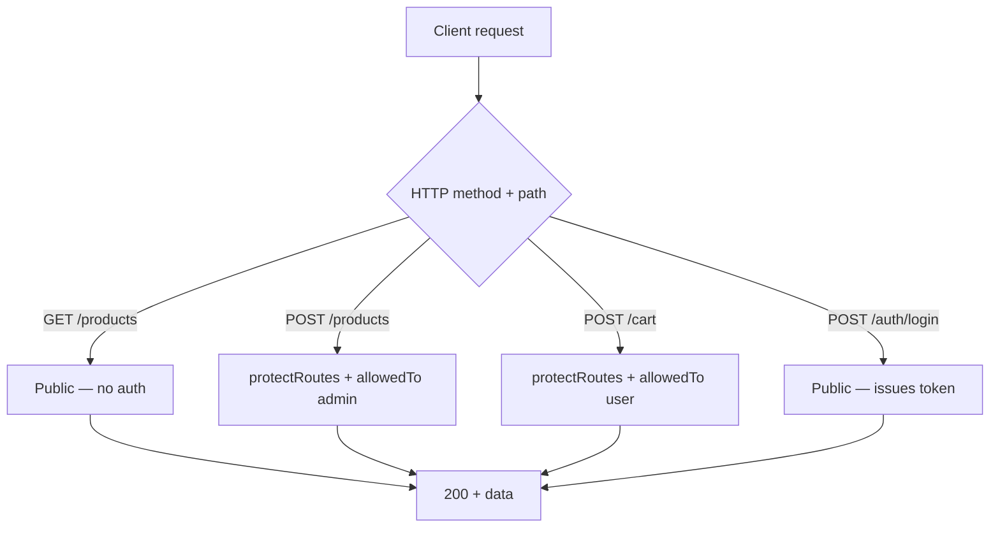

# Chapter 4: REST API Design & HTTP Semantics

## Overview

Middleware delivers the request to your handler. What the handler does with it — which HTTP method it uses, which status code it returns, how the JSON body is shaped — is the API contract your frontend, mobile app, and third-party clients depend on. A backend with inconsistent URLs, wrong status codes, and unpredictable response shapes forces every client to write defensive parsing code. A well-designed REST API makes integration obvious.

REST (Representational State Transfer) is not a framework feature. It is a set of conventions for modeling your domain as resources, manipulating them with standard HTTP verbs, and communicating outcomes with status codes. This e-commerce project implements most REST patterns correctly on catalog resources (brands, products, categories) while deliberately bending rules on cart, orders, and auth where domain logic demands it. Studying both the good patterns and the deviations teaches you when to follow the spec strictly and when pragmatism wins.

This chapter teaches you to design endpoints the way this project does — and to recognize where it should be improved. You will learn resource naming, method selection, status code semantics, response envelopes, nested resources, and the difference between public read endpoints and protected write endpoints. By the end, you will be able to design a new module's API surface before writing a single line of service logic.

## Learning Objectives

After completing this chapter, you will be able to:

1. **Design** resource-oriented URLs using plural nouns, consistent versioning, and nested parent-child paths.
2. **Select** the correct HTTP method and status code for create, read, update, delete, and action endpoints.
3. **Define** a consistent JSON response envelope and identify inconsistencies in an existing API.
4. **Model** public read vs protected write access patterns on catalog resources.
5. **Evaluate** when RPC-style action URLs (`/applyCoupon`, `/create-checkout-session`) are justified over pure REST.
6. **Implement** a new REST module with correct semantics using `handlerFactory` response conventions.

## Prerequisites

### Handbook chapters

- Chapter 1: Project Bootstrap & Runtime Architecture
- Chapter 2: Express Application Structure & API Versioning
- Chapter 3: The Request Lifecycle & Middleware Chain

### Knowledge

- HTTP methods: GET, POST, PUT, DELETE
- JSON request and response bodies
- Express route mounting and `router.route()` (Chapter 2)
- Middleware execution order (Chapter 3)

### Local setup

- Server running with `npm run dev`
- `GET /api/v1/brands` returns data (or an empty array)
- Optional: valid JWT token for testing protected routes

### Difficulty

Beginner–Intermediate

## Theory

### Resources, not actions

REST models your domain as **resources** — nouns, not verbs. A product is a resource. An order is a resource. URLs identify resources; HTTP methods define operations on them.

| Good (resource) | Bad (action) |
|---|---|
| `GET /api/v1/products` | `GET /api/v1/getProducts` |
| `POST /api/v1/orders` | `POST /api/v1/createOrder` |
| `DELETE /api/v1/cart/:cartItemId` | `POST /api/v1/removeCartItem` |

The e-commerce API mostly follows this rule. Exceptions exist where an operation is not a simple CRUD mutation — applying a coupon, creating a Stripe checkout session, updating order status. These are **RPC-style action endpoints** embedded in a REST API. They are pragmatic but should be used sparingly and named clearly.

### HTTP methods and their semantics

| Method | Idempotent | Safe | Body | Purpose |
|---|---|---|---|---|
| `GET` | Yes | Yes | No | Read resource(s) |
| `POST` | No | No | Yes | Create resource or trigger action |
| `PUT` | Yes | No | Yes | Full/partial replace of resource |
| `DELETE` | Yes | No | Rare | Remove resource |

**Idempotent** — calling it twice has the same effect as calling it once. `DELETE /brands/abc` deletes once; a second call returns 404 but the brand is still gone.

**Safe** — does not modify server state. `GET` never changes data. Do not use GET for operations that mutate state.

**PUT vs PATCH** — this project uses `PUT` for all updates. Strict REST uses `PATCH` for partial updates and `PUT` for full replacement. In practice, most Node APIs use `PUT` for both. Know the distinction for interviews; do not refactor this project unless you are versioning the API.

### Status codes — the API's feedback language

Status codes tell the client what happened without parsing the body. Use them precisely.

| Code | Meaning | When to use |
|---|---|---|
| `200` | OK | Successful GET, PUT, DELETE |
| `201` | Created | Successful POST that created a resource |
| `400` | Bad Request | Invalid input, malformed body |
| `401` | Unauthorized | Missing or invalid authentication |
| `403` | Forbidden | Authenticated but not permitted |
| `404` | Not Found | Resource does not exist |
| `500` | Internal Server Error | Unexpected server failure |

Common mistakes to avoid:

- `200` on create — use `201`
- `400` on not-found — use `404`
- `200` with `{ error: "..." }` in body — use the correct 4xx code
- `401` vs `403` — unauthenticated vs authenticated-but-denied

### Response envelope conventions

Clients parse responses more easily when the shape is predictable. This project uses several patterns:

**Factory CRUD (most catalog resources):**

```json
// GET one
{ "data": { ... } }

// GET all
{ "data": [ ... ], "pagination": { "page": 1, "limit": 10, ... } }

// POST create
{ "message": "data created successfully", "data": { ... } }

// PUT update
{ "message": "data updated successfully", "data": { ... } }

// DELETE
{ "message": "data deleted successfully" }
```

**Auth (different shape):**

```json
// Signup
{ "user": { ... }, "token": "..." }

// Login
{ "user": { ... }, "token": "..." }
```

**Reviews (inconsistent key):**

```json
// Create review — uses "review" not "data"
{ "message": "Review created successfully", "review": { ... } }
```

A production API picks one envelope and sticks to it. This project's factory-backed modules are consistent; bespoke services diverge. That is a refactoring target, not a pattern to copy.

### Nested resources express relationships

When a resource belongs to a parent, nest it in the URL:

```
GET  /api/v1/categories/:categoryId/subCategories
POST /api/v1/products/:productId/reviews
```

The parent ID in the URL tells the server the scope. The child resource does not need the parent ID repeated in the body (though this project injects it via middleware for safety — Chapter 2).

Flat alternatives also exist in this project:

```
GET /api/v1/subCategories
GET /api/v1/reviews
```

Nested for relationship context; flat for admin-wide queries. Document which is canonical.

### Public vs protected route design

Not every endpoint needs authentication. Design access intentionally:

| Access | Typical endpoints | This project |
|---|---|---|
| **Public read** | Product catalog, categories, brands | `GET /products`, `GET /brands` |
| **Public write** | Registration, login | `POST /auth/signup`, `POST /auth/login` |
| **Authenticated user** | Cart, wishlist, own orders | `POST /cart`, `GET /wishlist` |
| **Admin only** | Catalog mutations, order management | `POST /products`, `PUT /orders/status/:id` |

The pattern in route files: public methods on a router have no auth middleware; protected methods attach `protectRoutes` and `allowedTo` inline or at router scope (Chapter 3).



### When REST purity breaks down

Real e-commerce domains have operations that are not CRUD:

| Operation | This project's URL | Pure REST alternative |
|---|---|---|
| Apply coupon to cart | `POST /cart/applyCoupon` | `PATCH /cart` with `{ coupon }` |
| Create Stripe session | `POST /orders/create-checkout-session` | `POST /orders/checkout-sessions` |
| Update order status | `PUT /orders/status/:id` | `PATCH /orders/:id` with `{ status }` |
| Get logged-in user | `GET /users/getMe` | `GET /users/me` |

RPC-style URLs are acceptable when the operation is a **process** (checkout session) or **cross-entity** (apply coupon). Prefer REST shapes when the operation is a simple field update on a known resource (`PATCH /orders/:id` for status). Document your choices.

## Real Project Implementation

### Files in scope

| File | Role |
|---|---|
| `src/modules/brands/brands.route.js` | Canonical REST CRUD — public GET, admin mutations |
| `src/modules/product/product.route.js` | REST CRUD + nested reviews mount |
| `src/modules/auth/auth.route.js` | RPC-style auth actions (signup, login, reset) |
| `src/modules/cart/cart.route.js` | Verb overloading on `/` + action endpoint |
| `src/modules/orders/orders.route.js` | REST collection + RPC checkout/status routes |
| `src/modules/wishlist/wishlist.route.js` | User-scoped resource, non-standard DELETE param |
| `src/modules/user/user.route.js` | `getMe` self-service pattern |
| `src/services/handlerFactory.js` | Standard response shapes and status codes |
| `src/modules/auth/auth.service.js` | Auth-specific response shapes |
| `src/modules/cart/cart.service.js` | Mixed status codes and envelope patterns |
| `src/modules/orders/order.service.js` | Order creation, payment session responses |
| `src/modules/reviews/reviews.service.js` | Inconsistent `review` vs `data` key |

### How it works in this project

**Step 1 — Build the canonical REST module (brands).**

This is the template for every catalog resource. The route file maps HTTP semantics to handlers:

```18:45:nodeJS-ecommerce/src/modules/brands/brands.route.js
router
  .route("/")
  .post(
    protectRoutes,
    allowedTo("admin"),
    uploadImageBrand.single("image"),
    imageProcessor,
    createBrandValidation,
    createBrand,
  )
  .get(getAllBrands);
router
  .route("/:id")
  .put(
    protectRoutes,
    allowedTo("admin"),
    uploadImageBrand.single("image"),
    imageProcessor,
    createBrandValidation,
    updateBrand,
  )
  .get(getSingleBrandValidation, getSingleBrand)
  .delete(
    protectRoutes,
    allowedTo("admin"),
    deleteBrandValidation,
    deleteBrand,
  );
```

| Endpoint | Method | Auth | Status | Response key |
|---|---|---|---|---|
| `/api/v1/brands` | GET | Public | 200 | `data` (array) + `pagination` |
| `/api/v1/brands` | POST | Admin | 201 | `message` + `data` |
| `/api/v1/brands/:id` | GET | Public | 200 | `data` |
| `/api/v1/brands/:id` | PUT | Admin | 200 | `message` + `data` |
| `/api/v1/brands/:id` | DELETE | Admin | 200 | `message` |

When building a new resource from scratch, copy this route structure first. Wire factory handlers. Test all five endpoints. Then add validation (Chapter 5) and auth.

**Step 2 — Understand factory response contracts.**

`handlerFactory.js` encodes the project's standard HTTP semantics:

```36:57:nodeJS-ecommerce/src/services/handlerFactory.js
exports.createOne = (model) =>
  expressAsyncHandler(async (req, res, next) => {
    const document = await model.create(req.body);
    res
      .status(201)
      .json({ message: "data created successfully", data: document });
  });

exports.getOne = (model , populateOpt) =>
  expressAsyncHandler(async (req, res, next) => {
    const { id } = req.params;
    const query =  model.findById(id);

    if (populateOpt) {
      query.populate(populateOpt);
    }
    const document = await query;
    if (!document) {
      return next(new ApiError(404, `no document found for this id ${id}`));  
    }
    res.status(200).json({ data: document });
  });
```

Create → `201`. Read → `200`. Not found → `next(ApiError(404))` → global error handler. This is the pattern every factory-backed module inherits.

**Step 3 — Design public catalog reads vs admin writes.**

Products follow the same public-read / admin-write split:

```22:32:nodeJS-ecommerce/src/modules/product/product.route.js
router
  .route("/")
  .get(getProducts)
  .post(
    protectRoutes,
    allowedTo("admin"),
    uploadImageProduct,
    imageProcessor,
    createProductValidation,
    createProduct,
  );
```

`GET /api/v1/products` — any client, no token. `POST /api/v1/products` — admin only. This is the access pattern for every catalog resource in the project.

**Step 4 — Model user-scoped resources (cart).**

The cart is not a typical CRUD resource. Each user has at most one cart. The router overloads verbs on `/`:

```6:10:nodeJS-ecommerce/src/modules/cart/cart.route.js
router.route("/").post(addProductToCart).get(getLoggedUserCart).delete(clearCart);

router.route("/:cartItemId").delete(RemoveSpecificCartItem).put(UpdateCartItemQuantity);

router.route("/applyCoupon").post(applyCoupon);
```

| Endpoint | Method | Semantics |
|---|---|---|
| `POST /cart` | POST | Add product to cart (not "create cart" — upsert) |
| `GET /cart` | GET | Get logged-in user's cart |
| `DELETE /cart` | DELETE | Clear entire cart |
| `DELETE /cart/:cartItemId` | DELETE | Remove one line item |
| `PUT /cart/:cartItemId` | PUT | Update item quantity |
| `POST /cart/applyCoupon` | POST | Action — apply discount |

**Route order matters:** `/applyCoupon` must be registered before `/:cartItemId`, or Express treats `applyCoupon` as a cart item ID. This project registers `/applyCoupon` after `/:cartItemId` — a routing bug. Register static paths before parameterized paths.

**Step 5 — Design order and payment endpoints.**

Orders mix REST and RPC:

```14:25:nodeJS-ecommerce/src/modules/orders/orders.route.js
router
  .route("/")
  .get(allowedTo("user", "admin"), filterOrderForLoggedUser, getAllOrders)
  .post(createCashOrder);
router
  .route("/create-checkout-session")
  .post(protectRoutes, allowedTo("user"), CreatePaymentSession);
router
  .route("/:id")
  .get(getSpecificOrder)
  .put(allowedTo("admin"), updateOrderToPaid);
router.route("/status/:id").put(allowedTo("admin"), updateOrderStatus);
```

| Endpoint | REST purity | Notes |
|---|---|---|
| `GET /orders` | Pure REST | Scoped to logged user via middleware |
| `POST /orders` | Pure REST | Creates order from cart (cash) |
| `GET /orders/:id` | Pure REST | Ownership check in service |
| `PUT /orders/:id` | Partial | Admin marks paid — better as `PATCH` |
| `PUT /orders/status/:id` | RPC | Should be `PATCH /orders/:id` with `{ status }` |
| `POST /orders/create-checkout-session` | RPC | Returns Stripe URL, not an order resource |

`POST /orders/create-checkout-session` is registered **before** `/:id` — correct ordering. `/create-checkout-session` would otherwise match as an `:id`.

**Step 6 — Auth endpoints as RPC actions.**

Auth is inherently action-oriented, not resource CRUD:

```16:22:nodeJS-ecommerce/src/modules/auth/auth.route.js
router.route("/signup").post(signupValidation, Signup);
router.route("/login").post(signinValidation, Signin);
router.route("/forgetPassword").post(forgetPassword);
router
  .route("/verifyResetCode")
  .post(verifyResetCodeValidation, verifyResetCode);
router.route("/resetPassword").post(resetPassword);
```

All POST. No GET (passwords and tokens must never be in URLs). Response shapes differ from factory:

```22:22:nodeJS-ecommerce/src/modules/auth/auth.service.js
  res.status(201).json({ user, token });
```

```38:38:nodeJS-ecommerce/src/modules/auth/auth.service.js
  res.status(200).json({ user, token });
```

Signup → `201`. Login → `200`. Both return `{ user, token }` not `{ data }`.

**Step 7 — Self-service pattern with `getMe`.**

```35:35:nodeJS-ecommerce/src/modules/user/user.route.js
router.get("/getMe", getLoggedUser, getUser);
```

`GET /api/v1/users/getMe` returns the authenticated user's profile. Cleaner REST: `GET /api/v1/users/me`. The `getLoggedUser` middleware injects `req.params.id = req.user._id` so the existing `getUser` handler works without duplication.

### Key code

Order creation — correct `201` with message envelope:

```52:52:nodeJS-ecommerce/src/modules/orders/order.service.js
  res.status(201).json({ message: "Order created successfully", data: order });
```

Cart service — direct `res.status()` instead of `ApiError` (inconsistent error path):

```10:12:nodeJS-ecommerce/src/modules/cart/cart.service.js
  if (!product) {
    return res.status(404).json({ message: "Product not found" });
  }
```

Reviews — inconsistent response key on create:

```27:27:nodeJS-ecommerce/src/modules/reviews/reviews.service.js
  res.status(201).json({ message: "Review created successfully", review });
```

### Deviations in this codebase

- **Response envelope inconsistency** — factory uses `data`; auth uses `user`/`token`; reviews use `review`. Clients need three parsers.
- **404 catch-all returns 400** — `app.js` uses `ApiError(400, ...)` for unknown routes instead of 404.
- **Login failure returns 400, not 401** — `Signin` uses `res.status(400)` for invalid credentials. Many APIs use 401 to trigger client re-auth flows.
- **Cart route order** — `/applyCoupon` registered after `/:cartItemId` risks misrouting.
- **`PUT /orders/status/:id`** — RPC-style; `status` is not a resource ID. Prefer `PATCH /orders/:id`.
- **DELETE returns 200** — factory returns 200 with message. Some APIs return 204 No Content with empty body. Both are acceptable; pick one.
- **Mixed error patterns** — cart uses `res.status(404).json()`; orders use `next(new ApiError(404))`. Same outcome, different paths.

## Best Practices

1. **Use plural nouns for collections** — `/products`, `/orders`, `/brands`. *In this project: follows.*

2. **Return 201 on resource creation** — POST that creates a document gets 201, not 200. *In this project: follows in factory and orders; follows in auth signup.*

3. **Return 404 when a resource is not found** — never 400 for missing IDs. *In this project: partial — factory and orders follow; cart uses direct 404 responses; catch-all uses 400.*

4. **Use a consistent response envelope** — `{ data, message, pagination }` for all resources. *In this project: partial — factory modules consistent; auth and reviews diverge.*

5. **Register static path segments before parameterized routes** — `/applyCoupon` before `/:cartItemId`, `/create-checkout-session` before `/:id`. *In this project: partial — orders correct; cart incorrect.*

6. **Separate public reads from protected writes on the same resource** — attach auth only to mutating methods. *In this project: follows on brands, products, categories.*

7. **Use nested URLs for parent-child relationships** — `/products/:productId/reviews`. *In this project: follows.*

8. **Never put sensitive data in URLs** — passwords, tokens, and reset codes belong in the body. *In this project: follows on auth routes.*

## Common Mistakes

1. **Verbs in URLs** — `/api/v1/getProducts` couples the URL to implementation. **Fix:** `GET /api/v1/products`. *Auth routes intentionally use verbs — acceptable for non-CRUD flows.*

2. **200 on POST create** — Client cannot distinguish create from update. **Fix:** Always `201` with `Location` header (optional) and created resource in body.

3. **Inconsistent error shapes** — Some endpoints return `{ message }`, others `{ errors: [] }`, others `{ err: { message } }`. **Fix:** One error envelope via global handler. *This project has three shapes.*

4. **Using GET for state changes** — `GET /orders/cancel/:id` would be bookmarkable and cacheable — dangerous. **Fix:** Mutations always POST/PUT/DELETE.

5. **Wrong route registration order** — Parameterized routes swallow static segments. **Fix:** Static paths first. *Cart `applyCoupon` is at risk.*

6. **Returning full user object including password hash** — Signup/login return `user` from Mongoose. **Fix:** Use `toJSON` transform or `select('-password')` before responding. *Verify user model strips password in toJSON — pre-save hashes it; check if toJSON excludes it.*

## Production Notes

### Configuration

- **CORS headers** — Browsers block cross-origin API calls without `Access-Control-Allow-Origin`. Not configured in this project. Required before any frontend can call the API from a different domain.
- **Content-Type** — `express.json()` expects `Content-Type: application/json`. Reject unsupported content types with 415 Unsupported Media Type in strict APIs.

### Security & reliability

- **Rate limit auth endpoints** — `POST /auth/login` and `POST /auth/forgetPassword` are brute-force targets. Return 401/429, not verbose error messages that confirm email existence.
- **Do not leak resource existence** — `forgetPassword` returns 404 when email not found, confirming the email is not registered. Production APIs return a generic "If this email exists, we sent a code" regardless.
- **Pagination defaults** — factory `getAll` defaults to `limit=10`. Document max limits to prevent clients requesting `limit=100000`.
- **Idempotency for payments** — `POST /orders` and checkout session creation should support idempotency keys in production to prevent duplicate orders on retry.

### What this project is missing

- Unified response envelope across all modules
- Correct 404 on unknown routes (currently 400)
- `Location` header on 201 responses
- CORS configuration
- API documentation (OpenAPI/Swagger) describing every endpoint, method, and response
- Idempotency keys on order/payment endpoints
- `PATCH` support for partial updates
- Rate limiting on auth and write endpoints

## Senior Engineer Notes

**REST is a guide, not a religion.** This project's catalog modules (brands, categories, products) are clean REST. Cart, orders, and auth bend rules for valid reasons — a cart is a session-scoped aggregate, not a typical resource; checkout is a multi-step payment process; auth is inherently action-based. A senior engineer evaluates each endpoint: "Can a client predict this URL and method?" If yes, it is good enough. If the team debates it monthly, refactor.

**Trade-off: response envelope consistency.** Standardizing on `{ data, meta, errors }` (JSON:API style) or `{ success, data, message }` (simple wrapper) costs a refactor across every service file. The payoff is frontend SDK generation, automatic OpenAPI client typing, and simpler error handling. Do this before v2, not after.

**Trade-off: RPC action endpoints.** `POST /cart/applyCoupon` is immediately understandable. `PATCH /cart` with `{ coupon: "SAVE10" }` is more RESTful but requires clients to know the cart schema. For internal APIs where you control all clients, RPC is fine. For public APIs, lean REST.

**When to break REST.** Webhooks (`POST /webhook-checkout`), file uploads (multipart, not JSON CRUD), auth flows, payment provider redirects, and batch operations are all legitimate non-REST endpoints. Label them clearly in docs and keep them off the main resource routers when possible.

**Refactoring direction for this codebase.**

1. Standardize all success responses on `{ message?, data }` and all errors on global handler shape.
2. Change `PUT /orders/status/:id` → `PATCH /orders/:id` with `{ status }` in body.
3. Move `GET /users/getMe` → `GET /users/me`.
4. Fix cart route order: register `/applyCoupon` before `/:cartItemId`.
5. Change catch-all to `ApiError(404, ...)`.

**Scale considerations.** REST design does not affect runtime performance. It affects client adoption and team velocity. Inconsistent APIs slow frontend development more than slow queries do. Invest in contract consistency before optimizing database indexes.

## Interview Questions

### Conceptual

1. **Q:** What is the difference between PUT and PATCH? Which does this project use?
   **A:**
   - PUT replaces a resource (full or partial in practice)
   - PATCH applies partial updates to specific fields
   - This project uses PUT for all updates
   - Strict REST distinguishes them; most Node APIs conflate
   - Order status update would be idiomatic as PATCH

2. **Q:** When should you return 401 vs 403?
   **A:**
   - 401: client is not authenticated — missing or invalid token
   - 403: client is authenticated but lacks permission for this resource
   - Example: no token → 401; user token on admin endpoint → 403
   - This project: `protectRoutes` → 401; `allowedTo` → 403

3. **Q:** Why are auth endpoints (login, signup) RPC-style POST instead of REST resources?
   **A:**
   - Login is an action, not CRUD on a `/sessions` resource (though session resources are an alternative design)
   - Credentials must be in the body, never the URL
   - Response includes a token, not just a created resource
   - Password reset is a multi-step workflow, not a single resource mutation
   - Alternative: model `POST /sessions` as creating a session resource

### Applied

4. **Q:** Design the REST API for a `notifications` feature: users receive notifications, can list them, mark as read, and delete. What endpoints do you create?
   **A:**
   - `GET /api/v1/notifications` — list logged user's notifications (protected)
   - `GET /api/v1/notifications/:id` — get one (protected, ownership check)
   - `PATCH /api/v1/notifications/:id` — mark as read `{ read: true }` (protected)
   - `DELETE /api/v1/notifications/:id` — delete (protected)
   - `router.use(protectRoutes)` at router level
   - Status: 200 reads, 200/204 on patch/delete, 404 not found, 403 wrong user

5. **Q:** `POST /api/v1/cart/applyCoupon` returns 404 when the route is hit but coupon logic works on other machines. What do you check?
   **A:**
   - Route registration order — `/:cartItemId` may capture `applyCoupon` as an ID
   - Fix: move `router.route("/applyCoupon")` before `router.route("/:cartItemId")`
   - Verify with logging `req.params` in the handler
   - Express matches first registered compatible route

6. **Q:** A frontend developer says responses are unpredictable — sometimes `data`, sometimes `user`, sometimes `review`. How do you fix this?
   **A:**
   - Audit all `res.json()` calls across services
   - Define one envelope: `{ message?, data, pagination? }`
   - Refactor auth to `{ data: { user, token } }` or keep auth separate but document it
   - Refactor reviews `review` key to `data`
   - Route all errors through global handler for consistent error shape
   - Add OpenAPI spec as the contract source of truth

## Exercises

### Exercise 1 — Guided

**Goal:** Audit the brands and cart APIs for REST compliance by reading route and service files.

**Constraints:** Read only — no code changes. Use `brands.route.js`, `handlerFactory.js`, `cart.route.js`, `cart.service.js`.

**Success criteria:**
1. Table: every brands endpoint with method, URL, status code, response keys.
2. List three ways cart deviates from the brands REST pattern.
3. Identify the cart route ordering bug and explain its symptom.
4. Note one status code choice in cart that differs from factory conventions.

### Exercise 2 — Implement

**Goal:** Add a `tags` REST module with full CRUD following factory conventions.

**Constraints:** Use `handlerFactory` for all handlers. Public GET, admin POST/PUT/DELETE. Mount at `/api/v1/tags`.

**Success criteria:**
1. Schema: `name` (required, unique), `slug`.
2. Five endpoints with factory response shapes (`data`, `message`, `201` on create).
3. Route file mirrors `brands.route.js` access pattern.
4. `GET /api/v1/tags` returns `{ data: [], pagination: {...} }`.
5. `POST /api/v1/tags` without admin token returns 403.

### Exercise 3 — Challenge

**Goal:** Refactor order status update from RPC to REST without breaking existing clients.

**Constraints:** Add `PATCH /api/v1/orders/:id` for status updates. Keep `PUT /orders/status/:id` working but add a deprecation comment. Use `updateOrderStatus` logic in both.

**Success criteria:**
1. `PATCH /api/v1/orders/:id` with `{ status: "shipped" }` updates order (admin only).
2. Returns `{ message, data }` matching factory envelope.
3. Old `PUT /orders/status/:id` still works.
4. Document both endpoints in a comment block at the top of `orders.route.js`.
5. Invalid status value returns 400 with clear message.

## Summary

### Key takeaways

- REST models domain concepts as resources identified by nouns in URLs; HTTP methods express the operation.
- Status codes communicate outcomes: 201 for create, 200 for read/update, 404 for missing resources, 401/403 for auth failures.
- This project's factory-backed modules (brands, categories, products) are the REST template — copy them for new catalog resources.
- Cart, orders, and auth bend REST for pragmatic reasons; know when RPC-style action URLs are justified.
- Response envelope consistency matters as much as URL design — this project has three different success shapes to unify.
- Route registration order is part of API design — static segments before parameterized paths.

### Files to remember

`src/modules/brands/brands.route.js`, `src/services/handlerFactory.js`, `src/modules/cart/cart.route.js`, `src/modules/orders/orders.route.js`, `src/modules/auth/auth.route.js`, `src/modules/product/product.route.js`

You can now design endpoints with correct HTTP semantics; the next layer is enforcing input validity before those endpoints touch the database.

## Next Chapter Preview

**Next:** Chapter 5 — Input Validation & Data Integrity at the Boundary

A well-designed endpoint still fails if it accepts garbage input. Chapter 5 teaches `express-validator` — how this project validates signups, product creation, and review submissions before service logic runs, including async database checks for duplicate emails and foreign-key existence. You will learn why validation is a security boundary, not just a UX convenience, and fix the inconsistent validation error response path identified in Chapter 3.
