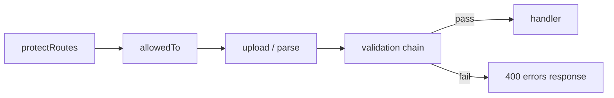

# Chapter 5: Input Validation & Data Integrity at the Boundary

## Overview

Your API accepts input from clients you do not control — web forms, mobile apps, scripts, attackers. Every field in `req.body`, `req.params`, and `req.query` is untrusted until validated. Service logic should never run on garbage input. Database queries should never execute with malformed ObjectIds. Business rules like "discount must be less than price" should fail before a document is created, not after.

Validation is the **boundary layer** between HTTP and your domain. It runs after body parsing and authentication (when auth is required) but before handlers touch the database for mutations. This project uses `express-validator` — a chain of declarative rules per route, terminated by a shared `validationResultMiddleware` that either calls `next()` or returns errors.

This chapter teaches you to build validation from scratch the way this e-commerce API does: sync format checks, async database uniqueness checks, cross-field rules, foreign-key existence verification, and ownership checks in validators. You will also learn where this project's validation is strong (product creation), where it is missing (cart, orders), and why the validation error response path needs fixing (identified in Chapters 3 and 4).

## Learning Objectives

After completing this chapter, you will be able to:

1. **Explain** why input validation belongs at the HTTP boundary, not inside service functions or Mongoose schemas alone.
2. **Implement** validation chains with `express-validator` (`check`, `param`, `body`) and a shared result middleware.
3. **Write** custom sync validators for cross-field rules and side effects like slug generation.
4. **Write** custom async validators for database uniqueness, foreign-key existence, and ownership checks.
5. **Attach** validation chains to routes in the correct middleware order relative to auth and file upload.
6. **Identify** validation gaps in an existing API and prioritize which endpoints need rules first.

## Prerequisites

### Handbook chapters

- Chapter 3: The Request Lifecycle & Middleware Chain
- Chapter 4: REST API Design & HTTP Semantics

### Knowledge

- Express middleware chaining and order (Chapter 3)
- REST request bodies and URL params (Chapter 4)
- Mongoose `findOne`, `findById` basics
- MongoDB ObjectId format

### Local setup

- Server running with `npm run dev`
- `express-validator` installed (already in `package.json`)
- MongoDB connected with at least one category and brand for product validation tests

### Difficulty

Intermediate

## Theory

### Why validate at the boundary

Validation serves three purposes:

1. **Data integrity** — only well-formed data enters your system.
2. **Security** — reject unexpected fields, type confusion, and injection payloads before they reach business logic.
3. **Client feedback** — return clear, field-level errors instead of cryptic database exceptions.

Mongoose schema validation is necessary but not sufficient. It runs at `model.create()` or `document.save()` — deep inside the stack. By then you have already executed middleware, possibly hit the database in service logic, and committed to a code path. Boundary validation fails fast with HTTP 400 and a useful message.

```
Without boundary validation:
  Request → handler → model.create() → Mongoose ValidationError → 500 or messy catch

With boundary validation:
  Request → validator chain → 400 with field errors (handler never runs)
```

Schema validation and boundary validation are complementary. Schema = last line of defense. Boundary = first.

### express-validator mental model

`express-validator` attaches validation rules to a request. Each rule is middleware. Rules accumulate; a final middleware reads all results.

```javascript
exports.signupValidation = [
  check("email").isEmail().withMessage("Invalid email"),
  check("password").isLength({ min: 6 }),
  validationResultMiddleware,  // reads all results, passes or rejects
];
```

Three validators for three input locations:

| Validator | Reads from | Example |
|---|---|---|
| `check("field")` | `req.body`, `req.query`, `req.cookies` (first match) | `check("email")` |
| `body("field")` | `req.body` only | `body("title")` |
| `param("id")` | `req.params` | `param("id").isMongoId()` |
| `query("page")` | `req.query` | `query("limit").isInt()` |

Chains are composable:

```javascript
check("email")
  .notEmpty().withMessage("Email is required")
  .isEmail().withMessage("Invalid email")
  .custom(async (val) => { /* DB check */ });
```

`.withMessage()` sets the error string returned to the client. Chain order matters — `.notEmpty()` before `.isEmail()` so empty string gets "required" not "invalid email".

### Sync vs async custom validators

**Sync custom** — compares fields, mutates `req.body`, no I/O:

```javascript
check("confirmPassword").custom((val, { req }) => {
  if (val !== req.body.password) {
    return Promise.reject("Passwords must match");
  }
  return true;
});
```

**Async custom** — hits the database:

```javascript
check("email").custom(async (val) => {
  const exists = await UserModel.findOne({ email: val });
  if (exists) return Promise.reject("Email already exists");
  return true;
});
```

Async validators run during the middleware phase. express-validator awaits them. Keep them fast — one indexed lookup per rule. Do not put entire business workflows in validators.

### Cross-field and business-rule validation

Some rules involve multiple fields:

- `confirmPassword` must equal `password`
- `priceAfterDiscount` must be less than `price`
- `subCategories` must all belong to `category`

Pattern: `.custom((value, { req }) => { ... })` with access to full `req.body`. Run the cross-field rule on the dependent field after the parent field is validated.

### Foreign-key existence checks

MongoDB does not enforce referential integrity at the database level (unless you use `$lookup` constraints in newer versions). Your API must verify FKs exist before creating documents:

```javascript
check("category")
  .isMongoId()
  .custom(async (categoryId) => {
    const category = await CategoryModel.findById(categoryId);
    if (!category) throw new Error("Category not found");
    return true;
  });
```

`.isMongoId()` catches malformed IDs before the DB round-trip. `.custom()` catches valid-format IDs that do not exist.

### Validation as authorization (ownership checks)

Some checks blur validation and authorization. This project validates review ownership inside `updateReviewValidator`:

```javascript
param("id").custom(async (val, { req }) => {
  const review = await ReviewModel.findById(val);
  if (review.user._id.toString() !== req.user.id.toString()) {
    return Promise.reject("You are not authorized to update this review");
  }
  return true;
});
```

This requires `protectRoutes` to run **before** the validator so `req.user` exists. Middleware order: auth → validation → handler.



### Side effects in validators — slug generation

This project generates slugs inside validators:

```javascript
body("title").custom((value, { req }) => {
  req.body.slug = slugify(value, { lower: true });
  return true;
});
```

This works but mixes transformation with validation. Alternatives: a dedicated `setSlug` middleware, or a Mongoose pre-save hook. The project chooses validator-side mutation for convenience — the handler receives a ready `req.body`. Know the trade-off: validators should ideally validate, not transform.

### The validation result gate

All chains end with the same middleware:

```javascript
const validationResultMiddleware = (req, res, next) => {
  const result = validationResult(req);
  if (result.isEmpty()) {
    return next();
  }
  res.send({ errors: result.array() });
};
```

`validationResult(req)` collects every failed rule. `result.array()` returns objects with `msg`, `path`, `location`, `value`. If empty, validation passed — call `next()` to reach the handler.

This project's gate uses `res.send()` directly instead of `next(new ApiError(400, ...))` — inconsistent with the global error handler (Chapter 3). Fixing this is Exercise 3 in Chapter 3 and a recurring improvement theme.

## Real Project Implementation

### Files in scope

| File | Role |
|---|---|
| `src/middlewares/validation.middleware.js` | Shared gate — collects results, passes or rejects |
| `src/modules/auth/auth.validation.js` | Signup, login, reset code validation |
| `src/modules/user/user.validation.js` | User CRUD, password change, email uniqueness |
| `src/modules/product/product.validation.js` | Richest validation — FK checks, cross-field rules, slug |
| `src/modules/reviews/reviews.validation.js` | Duplicate review prevention, ownership checks |
| `src/modules/category/category.validation.js` | Param ID validation, name length, slug |
| `src/modules/brands/brands.validation.js` | Create and param validation |
| `src/modules/subCategory/subCategory.validation.js` | Category FK format on create |
| `src/modules/product/product.route.js` | Example of validator placement in middleware chain |
| `src/modules/auth/auth.route.js` | Public auth routes with validation |

### How it works in this project

**Step 1 — Create the shared result middleware.**

Create `src/middlewares/validation.middleware.js`:

```javascript
const { validationResult } = require("express-validator");

const validationResultMiddleware = (req, res, next) => {
  const result = validationResult(req);
  if (result.isEmpty()) {
    return next();
  }
  res.status(400).json({ errors: result.array() });
};

module.exports = validationResultMiddleware;
```

Use `res.status(400)` explicitly — the current project omits it (defaults to 200 with error body — another bug).

**Step 2 — Build your first validation chain (signup).**

Create `src/modules/auth/auth.validation.js`:

```javascript
const { check } = require("express-validator");
const validationResultMiddleware = require("../../middlewares/validation.middleware");
const UserModel = require("../user/user.model");

exports.signupValidation = [
  check("name").notEmpty().withMessage("Name is required"),
  check("email")
    .notEmpty().withMessage("Email is required")
    .isEmail().withMessage("Invalid email")
    .custom(async (val) => {
      const user = await UserModel.findOne({ email: val });
      if (user) return Promise.reject("Email already exist");
      return true;
    }),
  check("password")
    .notEmpty().withMessage("Password is required")
    .isLength({ min: 6 }).withMessage("Password must be at least 6 characters"),
  check("confirmPassword").custom((val, { req }) => {
    if (val !== req.body.password) {
      return Promise.reject("confirmPassword must be equal to password");
    }
    return true;
  }),
  validationResultMiddleware,
];
```

**Step 3 — Attach the chain to the route.**

In `auth.route.js`, pass the array as middleware — Express runs each element in order:

```16:17:nodeJS-ecommerce/src/modules/auth/auth.route.js
router.route("/signup").post(signupValidation, Signup);
router.route("/login").post(signinValidation, Signin);
```

When you pass an array to a route, Express treats each item as sequential middleware. The last item before the handler is `validationResultMiddleware`; the handler `Signup` runs only if validation passes.

**Step 4 — Validate URL params on GET/DELETE.**

Param validation prevents malformed ObjectIds from hitting Mongoose (which throws CastError):

```106:109:nodeJS-ecommerce/src/modules/product/product.validation.js
exports.getProductByIdValidation = [
  param("id").isMongoId().withMessage("Invalid product id"),
  validationResultMiddleware,
];
```

Wired on the route:

```35:35:nodeJS-ecommerce/src/modules/product/product.route.js
  .get(getProductByIdValidation, getProductById)
```

**Step 5 — Build comprehensive create validation (products).**

Product creation is the most complete validation in the project — study it as the template for complex resources:

| Rule type | Field | Implementation |
|---|---|---|
| Required | `title`, `description`, `quantity`, `price` | `.notEmpty()` |
| Cross-field | `priceAfterDiscount` | must be `< price` |
| Type | `colors`, `images` | `.optional().isArray()` |
| FK format | `category`, `brand` | `.isMongoId()` |
| FK existence | `category`, `brand` | async `.custom()` with `findById` |
| FK relationship | `subCategories` | all exist AND belong to `category` |
| Side effect | `title` | generates `slug` via `body().custom()` |

The subcategory relationship check is the most advanced rule:

```55:72:nodeJS-ecommerce/src/modules/product/product.validation.js
  check("subCategories").custom(async (subCategoryIds, { req }) => {
    // check existance
    const subCategories = await SubCategoryModel.find({
      _id: { $in: subCategoryIds },
    });
    if (subCategoryIds && subCategories.length !== subCategoryIds.length) {
      throw new Error("Some subCategories are not found");
    }

    // check belong to the category
    const isSubCategoryBelongToCategory = subCategories.every(
      (sub) => sub.category.toString() === req.body.category.toString(),
    );
    if (!isSubCategoryBelongToCategory) {
      throw new Error("Some subCategories are not belong to the category");
    }
    return true;
  }),
```

**Step 6 — Validate ownership in update/delete (reviews).**

Reviews demonstrate auth-dependent validation:

```36:54:nodeJS-ecommerce/src/modules/reviews/reviews.validation.js
exports.updateReviewValidator = [
    param("id").isMongoId().withMessage("Invalid review id")
    .custom(async (val , {req} ) => {
        const review = await ReviewModel.findById(val);

        if(!review) {
            return Promise.reject("Review not found");
        }

        if(review.user._id.toString() !== req.user.id.toString()) {
            return Promise.reject("You are not authorized to update this review");
        }
        return true;
    }),
    check("title").notEmpty().withMessage("Title is required"),
    check("rate").notEmpty().withMessage("Rate is required").isFloat({ min: 1, max: 5 }).withMessage("Rate must be between 1 and 5"),
    
    validationResultMiddleware,
]
```

Route order ensures `req.user` exists:

```33:33:nodeJS-ecommerce/src/modules/reviews/reviews.route.js
  .put(protectRoutes, allowedTo("user"), updateReviewValidator, updateReview)
```

**Step 7 — Password change with current password verification.**

`user.validation.js` combines format rules with bcrypt verification:

```79:98:nodeJS-ecommerce/src/modules/user/user.validation.js
exports.updateUserPasswordValidator = [
  param("id").isMongoId().withMessage("Invalid user id"),
  check("currentPassword")
    .notEmpty()
    .withMessage("current password is required")
    .custom(async (val, { req }) => {
      if (!val) {
        return true;
      }
      const user = await UserModel.findById(req.params.id);

      if (!user) {
        return Promise.reject("user not found");
      }
      const isMatch = await bcrypt.compare(val, user.password);
      if (!isMatch) {
        return Promise.reject("current password is incorrect");
      }
      return true;
    }),
```

**Step 8 — Know what is NOT validated (gaps).**

These modules have **no** `*.validation.js` files:

| Module | Risk |
|---|---|
| `cart` | `productId` not validated as ObjectId; quantity not checked |
| `orders` | No status enum validation; `isPaid` not validated |
| `wishlist` | `productId` not validated |
| `userAddress` | Address fields not validated |
| `coupon` | Uses factory only — no discount range or date validation |
| `auth` | `forgetPassword`, `resetPassword` unvalidated |

When extending this project, prioritize cart and orders — they touch money and inventory.

### Key code

Shared validation gate:

```4:11:nodeJS-ecommerce/src/middlewares/validation.middleware.js
const validationResultMiddleware = (req, res , next) => {
    const result = validationResult(req);
    if (result.isEmpty()) {
      return next();
    }
  
    res.send({ errors: result.array() });
}
```

Product route — validation after upload middleware (important ordering note):

```25:31:nodeJS-ecommerce/src/modules/product/product.route.js
  .post(
    protectRoutes,
    allowedTo("admin"),
    uploadImageProduct,
    imageProcessor,
    createProductValidation,
    createProduct,
  );
```

Multer and Sharp run first, populating `req.body.imageCover` from the uploaded file. Validation then checks `imageCover` is present. If validation ran before upload, `imageCover` would always fail on multipart requests.

Duplicate review prevention — business rule in validator:

```20:30:nodeJS-ecommerce/src/modules/reviews/reviews.validation.js
    check("user").notEmpty().withMessage("User is required").isMongoId().withMessage("Invalid user id").custom(async(val , {req}) => {
        const user = await UserModel.findById(val);
        if(!user) {
            return Promise.reject("User not found");
        }

        const reviews = await ReviewModel.find({ user: val , product: req.body.product });
        if(reviews.length > 0) {
            return Promise.reject("You have already reviewed this product");
        }
        return true;
    }),
```

### Deviations in this codebase

- **Validation errors bypass global error handler** — `res.send({ errors })` with no status code (defaults 200) and different shape from `ApiError` responses.
- **Weak update validation on products** — `updateProductValidation` only checks `param("id")` and slug; no field rules on update.
- **Brands reuse `createBrandValidation` on PUT** — update route uses create validator (requires `name`) instead of a dedicated update chain.
- **Subcategory create does not verify category exists** — checks `isMongoId()` but no async `findById`.
- **Auth gaps** — `forgetPassword` and `resetPassword` accept any body.
- **Slug in validators** — transformation mixed with validation across category, brand, product, user modules.
- **Review update validator** — `review.user._id` assumes populate; `findById` without populate may make `review.user` a raw ObjectId, breaking ownership check.

## Best Practices

1. **Validate at the boundary before handlers run** — fail fast with 400, not deep with 500. *In this project: follows where validators exist.*

2. **End every chain with shared result middleware** — one gate, consistent behavior. *In this project: follows.*

3. **Validate params on all routes with `:id`** — `.isMongoId()` prevents CastError. *In this project: follows on catalog modules; missing on cart/wishlist.*

4. **Use `.isMongoId()` before async FK lookups** — reject malformed IDs without a DB round-trip. *In this project: follows on product FK fields.*

5. **Keep auth before ownership validators** — `req.user` must exist. *In this project: follows on review routes.*

6. **Place upload middleware before validation on multipart routes** — validated fields from file processing must exist first. *In this project: follows on product and user routes.*

7. **Return HTTP 400 with explicit status for validation failures** — never 200 with error body. *In this project: missing — `res.send` without status.*

8. **Route validation failures through global error handler** — one error contract for all failure types. *In this project: missing.*

## Common Mistakes

1. **Validating only in Mongoose schema** — Client gets 500 instead of 400; error message exposes internal structure. **Fix:** Boundary validation first, schema as backup.

2. **Wrong middleware order — validation before auth** — Ownership validators cannot access `req.user`. **Fix:** `protectRoutes` → `allowedTo` → validation → handler.

3. **Wrong middleware order — validation before file upload** — `imageCover` fails because multer has not run. **Fix:** upload → imageProcessor → validation → handler. *Product route does this correctly.*

4. **Async validator without error handling** — Unhandled DB errors crash the middleware chain. **Fix:** try/catch in custom validators or let express-validator propagate to global handler.

5. **Validating on create but not update** — Update endpoints accept empty or malicious bodies. **Fix:** Separate `updateXValidation` with `.optional()` fields. *Product update is weak.*

6. **Trusting client-supplied user IDs** — Review create accepts `user` in body but also injects from `req.user` via middleware. Validator checks body `user` — ensure it matches `req.user` or ignore body entirely. **Fix:** Set `req.body.user = req.user.id` in middleware, remove from client contract.

## Production Notes

### Configuration

- **Validation strictness** — Production APIs often strip unknown fields (`check("*").custom(sanitize)`) to prevent mass-assignment. This project passes `req.body` directly to `model.create()` — any extra fields Mongoose ignores if not in schema, but explicit whitelisting is safer.
- **Locale** — `isMobilePhone("ar-EG")` in user validation is region-specific. Configure per deployment market.

### Security & reliability

- **NoSQL injection** — `express-validator` type checks mitigate object injection in queries. Never pass raw `req.body` to `$where` or unvalidated query builders.
- **Rate limit validation-heavy endpoints** — Signup email uniqueness check is a DB query per attempt — pair with rate limiting to prevent enumeration.
- **Error message leakage** — "Email already exist" on signup confirms email registration. Some APIs use generic messages; balance UX vs privacy.
- **Validator DB load** — Product create runs 3+ DB lookups per request. Acceptable at low scale; cache reference data (categories, brands) at scale.

### What this project is missing

- Validation on cart, orders, wishlist, coupon, userAddress modules
- `forgetPassword` / `resetPassword` input validation
- `res.status(400)` on validation failure
- Unified error format via `next(ApiError(400, ...))`
- Dedicated update validators (not reusing create validators)
- `req.body.user` vs `req.user.id` consistency on reviews
- `.optional()` field handling on partial update validators
- `express-validator` `bail()` to stop chain on first failure (performance)

## Senior Engineer Notes

**Validation vs authorization.** Ownership checks in `reviews.validation.js` are authorization logic wearing validation clothing. Strict layering puts authorization in middleware (`canModifyReview`) and keeps validators for shape/uniqueness only. Combined approach (this project) reduces files but blurs boundaries. For a small team learning, it is fine. For a large team, separate them.

**Trade-off: fat validators vs fat services.** Product `createProductValidation` is 80+ lines with DB calls. Alternative: validate format in validator, validate relationships in service. The project front-loads everything into validators so handlers stay one-liners via factory. Works until rules need transactions or multi-step logic — then move to service.

**Trade-off: slug in validator.** Convenient but surprising — reading `product.validation.js` to understand validation also reveals data transformation. A `setSlugFromTitle` middleware between validation and handler is more explicit.

**When to break express-validator.** Complex multi-field workflows (checkout, payment) need service-level validation with transactions. JSON Schema (Ajv) or Zod at the boundary scales better for large teams with shared schemas across frontend and backend. express-validator is the right choice for this Express + Udemy-scale project.

**Refactoring direction for this codebase.**

1. Fix `validation.middleware.js` to `return next(new ApiError(400, errors))`.
2. Add `cart.validation.js` — `productId` is MongoId, product exists, quantity is positive int.
3. Split `updateBrandValidation` from create; use `.optional()` on fields.
4. On review create, remove `user` from client body — set in `addProductIdAndUserIdToBody` only, drop from validator.
5. Add `forgetPasswordValidation` — `email` required, isEmail.

**Scale considerations.** Async validators that each hit MongoDB add latency linearly with rule count. Use `bail()` to short-circuit, combine FK checks into one query, or validate relationships in a single service transaction at scale.

## Interview Questions

### Conceptual

1. **Q:** Why validate at the HTTP boundary instead of relying only on Mongoose schema validation?
   **A:**
   - Boundary validation fails before handler and business logic run
   - Returns HTTP 400 with field-level errors clients can display
   - Mongoose errors are generic and often surface as 500
   - Security: reject malformed input before any DB write
   - Both layers together provide defense in depth

2. **Q:** What is the difference between `check()`, `body()`, and `param()` in express-validator?
   **A:**
   - `check()` searches body, then query, then cookies
   - `body()` only `req.body`
   - `param()` only `req.params` (URL path segments)
   - Use `param("id").isMongoId()` for route IDs
   - Use `body()` when you want to be explicit and avoid ambiguity

3. **Q:** Why must `protectRoutes` run before validators that check `req.user`?
   **A:**
   - Ownership validators compare against `req.user.id`
   - Without auth middleware, `req.user` is undefined
   - Validator throws or rejects incorrectly
   - Order: authenticate → authorize role → validate → handle
   - Same principle applies to any middleware that sets context validators depend on

### Applied

4. **Q:** Design a validation chain for `POST /api/v1/cart` with body `{ productId, quantity }`.
   **A:**
   - `check("productId").notEmpty().isMongoId().withMessage("Invalid product id")`
   - `.custom(async (id) => { product = await ProductModel.findById(id); if (!product) reject("Not found"); })`
   - `check("quantity").optional().isInt({ min: 1 }).withMessage("Quantity must be positive")`
   - `validationResultMiddleware` last
   - Attach after `protectRoutes` on cart router

5. **Q:** Product create with multipart form fails "imageCover is required" even when a file is uploaded. Diagnose.
   **A:**
   - Validation likely runs before multer/imageProcessor
   - Upload middleware must run first to set `req.body.imageCover`
   - Correct order: uploadImageProduct → imageProcessor → createProductValidation → createProduct
   - This project's product route has correct order — check if caller sends field name `imageCover` not `image`

6. **Q:** How would you unify validation errors with the global `ApiError` error format?
   **A:**
   - In `validationResultMiddleware`, format `result.array()` into a message or field map
   - Call `next(new ApiError(400, message))` or a specialized `ValidationError` subclass
   - Global handler sends consistent `{ statusCode, message }` shape
   - Clients get one parser for all errors
   - Optionally include `errors: result.array()` in dev only

## Exercises

### Exercise 1 — Guided

**Goal:** Trace the signup validation pipeline by reading code only.

**Constraints:** Read `auth.route.js`, `auth.validation.js`, `validation.middleware.js`. No code changes.

**Success criteria:**
1. List every rule applied to `POST /api/v1/auth/signup` in execution order.
2. Identify which rules are sync vs async.
3. Describe the response body when email is missing vs when email already exists.
4. Answer: does the `Signup` handler run if validation fails?

### Exercise 2 — Implement

**Goal:** Add validation for `POST /api/v1/cart`.

**Constraints:** Create `src/modules/cart/cart.validation.js`. Do not change cart business logic.

**Success criteria:**
1. `productId` — required, valid MongoId, product must exist in DB.
2. Optional `quantity` — if provided, integer ≥ 1.
3. Chain ends with `validationResultMiddleware`.
4. Attached to `POST /` in `cart.route.js` after auth middleware.
5. `POST /cart` with invalid `productId` returns 400 with `errors` array; valid id still adds to cart.

### Exercise 3 — Challenge

**Goal:** Fix validation middleware and add missing auth validations.

**Constraints:** Modify `validation.middleware.js` and `auth.validation.js` only (plus wire routes in `auth.route.js`).

**Success criteria:**
1. Validation failures call `next(new ApiError(400, ...))` with formatted error list.
2. Global error handler returns same envelope as other 400 errors.
3. Add `forgetPasswordValidation` — email required, valid email format.
4. Add `resetPasswordValidation` — email required, password min 6, confirmPassword matches.
5. Wire both on their routes in `auth.route.js`.
6. `POST /auth/signup` with bad email still works as before (same rules, new error path).

## Summary

### Key takeaways

- Input validation is a security and integrity boundary — untrusted data stops at the validator, not at the database.
- `express-validator` chains rules as middleware; every chain ends with a shared result gate.
- Use `check`/`body` for request body, `param` for URL IDs, sync custom for cross-field rules, async custom for DB checks.
- Middleware order: auth → upload (if multipart) → validation → handler.
- Product validation is the project's gold standard — FK existence, cross-field rules, relationship integrity.
- Cart, orders, and several auth endpoints lack validation — highest-priority gaps for production.
- Validation errors should use HTTP 400 and flow through the global error handler for a consistent API contract.

### Files to remember

`src/middlewares/validation.middleware.js`, `src/modules/auth/auth.validation.js`, `src/modules/product/product.validation.js`, `src/modules/reviews/reviews.validation.js`, `src/modules/user/user.validation.js`, `src/modules/product/product.route.js`

With valid input reaching your handlers, the next question is what happens when something still goes wrong — and how errors propagate back to the client consistently.

## Next Chapter Preview

**Next:** Chapter 6 — Error Handling & Operational vs Programmer Errors

Validation catches bad input, but servers still face missing resources, expired tokens, database failures, and unexpected bugs. Chapter 6 dissects this project's `ApiError` class, global error handler, JWT error remapping, and dev vs production response shapes — and teaches you to build an error strategy where every failure path produces a predictable, safe response.
