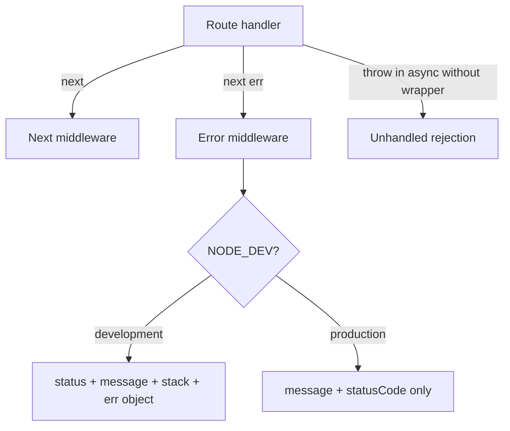

# Chapter 6: Error Handling & Operational vs Programmer Errors

## Overview

Every backend fails. Users request resources that do not exist. Tokens expire. Databases go offline. Developers ship bugs. The difference between a fragile API and a production-grade API is not whether errors happen — it is whether failures are **handled predictably**.

Clients should receive one error contract: a status code that means something, a message safe to display, and (in development only) enough detail to debug. Servers should distinguish **operational errors** (expected failures you plan for) from **programmer errors** (bugs that need fixing). This project implements a centralized pattern with `ApiError` and `globalErrorHandler`, but several modules bypass it — cart returns `res.status(404).json()` directly, validation uses `res.send({ errors })`, and auth login uses `res.status(400)`. Studying both the correct pattern and the inconsistencies teaches you what a unified error strategy looks like and how to get there.

This chapter teaches you to build error handling from scratch: create operational error classes, wire Express's four-argument error middleware, remap library-specific errors (JWT), and branch responses by environment. You will trace every error path in this project and learn which to standardize first.

## Learning Objectives

After completing this chapter, you will be able to:

1. **Distinguish** operational errors (expected, client-facing) from programmer errors (bugs, server-facing).
2. **Implement** a custom `ApiError` class and Express global error-handling middleware.
3. **Propagate** errors through async handlers using `next(err)` and `express-async-handler`.
4. **Remap** third-party library errors (JWT, Mongoose) into consistent HTTP responses.
5. **Design** development vs production error responses that balance debuggability and security.
6. **Audit** an existing codebase for error-handling inconsistencies and prioritize fixes.

## Prerequisites

### Handbook chapters

- Chapter 3: The Request Lifecycle & Middleware Chain
- Chapter 5: Input Validation & Data Integrity at the Boundary

### Knowledge

- Express middleware and `next()` (Chapter 3)
- HTTP status codes (Chapter 4)
- `express-async-handler` wrapping async routes
- JavaScript `Error` class and `throw`

### Local setup

- Server running with `npm run dev`
- `NODE_DEV=development` in `config.env`
- Optional: valid and expired JWT tokens for testing auth errors

### Difficulty

Intermediate

## Theory

### Two categories of errors

| Type | Operational | Programmer |
|---|---|---|
| **Expected?** | Yes — part of normal operation | No — bug or unexpected state |
| **Examples** | 404 not found, 401 unauthorized, 400 validation | `undefined is not a function`, null reference |
| **Client message** | Safe, specific | Generic "Something went wrong" |
| **Action** | Return appropriate 4xx | Log, alert, fix code |
| **Stack trace to client?** | Never in production | Never in production |

Operational errors are **trusted**. You created them intentionally with `new ApiError(404, "Order not found")`. Programmer errors are **untrusted**. You did not plan for them. Production must not expose their details.

This project's `ApiError` sets `isOperational = true` to mark errors you expect. The global handler does not currently check this flag — an improvement opportunity for production hardening.

### Express error middleware mechanics

Regular middleware: `(req, res, next)`.

Error middleware: `(err, req, res, next)` — **four parameters**. Express detects the arity and routes `next(err)` calls to it.



Rules:

1. Error middleware is registered **after** all routes.
2. Only one error handler is typical (this project has one).
3. `next(err)` from any middleware or handler jumps to it.
4. Sync `throw err` in non-async code also reaches it.
5. Async `throw` without `express-async-handler` does **not** reach it.

### The next(err) contract

The correct way to fail from a handler:

```javascript
// Good — reaches global handler
if (!order) {
  return next(new ApiError(404, "Order not found"));
}

// Bad — bypasses global handler, inconsistent shape
if (!order) {
  return res.status(404).json({ message: "Order not found" });
}
```

Always `return next(err)` to prevent the handler from continuing after the error.

`express-async-handler` converts rejected promises and thrown errors into `next(err)`:

```javascript
const handler = expressAsyncHandler(async (req, res, next) => {
  const doc = await Model.findById(id); // throws CastError if invalid
  if (!doc) throw new ApiError(404, "Not found"); // also works
  res.json({ data: doc });
});
```

Both `next(new ApiError(...))` and `throw new ApiError(...)` inside wrapped handlers reach the global error handler.

### Custom operational error classes

```javascript
class ApiError extends Error {
  constructor(statusCode, message) {
    super(message);
    this.statusCode = statusCode;
    this.state = `${statusCode}`.startsWith("4") ? "fail" : "error";
    this.isOperational = true;
  }
}
```

`statusCode` drives the HTTP response. `state` distinguishes client errors (`fail`) from server errors (`error`). `isOperational` flags trusted errors.

Usage:

```javascript
next(new ApiError(404, "Product not found"));  // 404
next(new ApiError(403, "Not authorized"));     // 403
next(new ApiError(400, "Invalid input"));      // 400
```

For programmer errors you did not wrap, the global handler defaults to `statusCode || 500`.

### Remapping library errors

Third-party libraries throw their own error types with unhelpful messages. Remap them in the global handler:

**JWT errors** (this project):

```javascript
if (err.name === "JsonWebTokenError") {
  err.message = "Invalid token, please login again";
  err.statusCode = 401;
}
if (err.name === "TokenExpiredError") {
  err.message = "Token expired, please login again";
  err.statusCode = 401;
}
```

`jwt.verify()` throws these inside `protectRoutes`. Without remapping, clients would see cryptic library messages or 500s.

**Mongoose CastError** (not in this project — gap):

Invalid ObjectId in `findById("not-an-id")` throws `CastError`. Should remap to 400 "Invalid ID format".

**Multer errors** — file too large, wrong type. This project passes `ApiError` via multer callback:

```javascript
cb(new ApiError(400, "Accept images only"), false);
```

Multer forwards this to Express error handling if wired correctly.

### Development vs production responses

**Development** — maximize debuggability:

```json
{
  "status": "error",
  "message": "Order not found",
  "statusCode": 404,
  "stack": "ApiError: Order not found\n    at ...",
  "err": { ... }
}
```

**Production** — minimize leakage:

```json
{
  "err": {
    "message": "Order not found",
    "statusCode": 404
  }
}
```

No stack trace. No internal error object. For 500 errors in production, use a generic message: "Internal server error" — never expose the real bug message to clients.

This project gates on `NODE_DEV === "development"`. Convention elsewhere is `NODE_ENV === "production"`.

### Errors outside Express

Not every failure happens inside a request. Bootstrap failures, background jobs, and unhandled rejections live outside the middleware chain.

```javascript
// server.js
process.on("unhandledRejection", (err) => {
  console.error("UNHANDLED REJECTION:", err);
  server.close(() => process.exit(1));
});
```

These never reach `globalErrorHandler`. Handle them at the process level (Chapter 1). Webhook handler in this project uses `throw new ApiError(...)` inside a helper called from the webhook — if not caught, it becomes an unhandled rejection inside the request (async handler should catch it via express-async-handler on webHookHandler).

### The 404 catch-all pattern

Unknown routes should become operational errors:

```javascript
app.use((req, res, next) => {
  next(new ApiError(404, `This route ${req.originalUrl} not found`));
});
```

This project uses status **400** instead of **404** — a semantic bug. The mechanism (catch-all → `next(ApiError)` → global handler) is correct; the status code is wrong.

## Real Project Implementation

### Files in scope

| File | Role |
|---|---|
| `src/utils/apiError.js` | Operational error class |
| `src/middlewares/error.midleware.js` | Global error handler — JWT remap, dev/prod branches |
| `src/app.js` | 404 catch-all → `next(ApiError)`, terminal error handler mount |
| `src/middlewares/validation.middleware.js` | Bypasses global handler — direct `res.send` |
| `src/services/handlerFactory.js` | Canonical `next(ApiError(404))` pattern |
| `src/modules/auth/auth.service.js` | Mixed: `next(ApiError)` for auth, direct `res.status` for login |
| `src/modules/cart/cart.service.js` | Mostly direct `res.status` — inconsistent |
| `src/modules/orders/order.service.js` | Mostly `next(ApiError)` — consistent |
| `src/utils/multerFileFilter.js` | Passes `ApiError` to multer callback |
| `server.js` | Process-level `unhandledRejection` handler |

### How it works in this project

**Step 1 — Create `ApiError`.**

Create `src/utils/apiError.js`:

```javascript
class ApiError extends Error {
  constructor(statusCode, message) {
    super(message);
    this.statusCode = statusCode;
    this.state = `${statusCode}`.startsWith("4") ? "fail" : "error";
    this.isOperational = true;
  }
}

module.exports = ApiError;
```

**Step 2 — Create the global error handler.**

Create `src/middlewares/error.midleware.js`:

```javascript
const sendErrorForDev = (err, res) => {
  const statusCode = err.statusCode || 500;
  res.status(statusCode).json({
    status: err.status || "error",
    message: err.message,
    statusCode,
    stack: err.stack,
    err,
  });
};

const sendErrorForProd = (err, res) => {
  const statusCode = err.statusCode || 500;
  const message = err.isOperational ? err.message : "Something went wrong";
  res.status(statusCode).json({
    status: err.state || "error",
    message,
    statusCode,
  });
};

const globalErrorHandler = (err, req, res, next) => {
  // Remap JWT errors
  if (err.name === "JsonWebTokenError") {
    err.message = "Invalid token, please login again";
    err.statusCode = 401;
  }
  if (err.name === "TokenExpiredError") {
    err.message = "Token expired, please login again";
    err.statusCode = 401;
  }

  if (process.env.NODE_DEV === "development") {
    sendErrorForDev(err, res);
  } else {
    sendErrorForProd(err, res);
  }
};

module.exports = globalErrorHandler;
```

**Step 3 — Mount as the last middleware in `app.js`.**

```51:58:nodeJS-ecommerce/src/app.js
// Handle all routes
app.use((req, res, next) => {
  const path = req.originalUrl;
  next(new ApiError(400, `This route ${path} not found`));
});

// Global error handling middleware
app.use(globalErrorHandler);
```

Nothing registers after line 58. This is non-negotiable.

**Step 4 — Use `next(ApiError)` in handlers (the correct pattern).**

`handlerFactory.js` — the template every service should follow:

```10:12:nodeJS-ecommerce/src/services/handlerFactory.js
    if (!Model) {
      return next(new ApiError(404, `no Model found for this id ${id}`));
    }
```

`order.service.js` — consistent operational errors:

```13:15:nodeJS-ecommerce/src/modules/orders/order.service.js
  if (!cart) {
    return next(new ApiError(404, "No cart found for this user"));
  }
```

```63:67:nodeJS-ecommerce/src/modules/orders/order.service.js
  if (req.user.role !== "admin" && order.user !== req.user._id) {
    return next(
      new ApiError(403, "You are not authorized to access this order"),
    );
  }
```

Auth middleware — same pattern:

```48:48:nodeJS-ecommerce/src/modules/auth/auth.service.js
    return next(new ApiError(401, "Unauthorized, you are not logged in"));
```

**Step 5 — Recognize the bypass patterns (inconsistent).**

**Cart** — direct response, never reaches global handler:

```10:12:nodeJS-ecommerce/src/modules/cart/cart.service.js
  if (!product) {
    return res.status(404).json({ message: "Product not found" });
  }
```

**Auth login** — direct 400 instead of 401:

```28:30:nodeJS-ecommerce/src/modules/auth/auth.service.js
  if (!user) {
    return res.status(400).json({ message: "Invalid email or password" });
  }
```

**Validation** — different shape entirely:

```10:10:nodeJS-ecommerce/src/middlewares/validation.middleware.js
    res.send({ errors: result.array() });
```

No status code set (HTTP 200 default). Shape is `{ errors: [...] }` not `{ message, statusCode }`.

**Step 6 — Trace a complete error flow.**

`GET /api/v1/products/invalid-id` with `getProductByIdValidation`:

1. Validator catches malformed ID → `res.send({ errors })` — **validation path, not global handler**
2. If validation removed and invalid ID hits `findById` → Mongoose CastError → `express-async-handler` → global handler → 500 (no CastError remap)

`GET /api/v1/products/507f1f77bcf86cd799439011` (valid format, not found):

1. Passes validation
2. `getOne` handler → `next(new ApiError(404, ...))` → global handler → 404 JSON

`GET /api/v1/orders` without token:

1. `protectRoutes` → `next(ApiError(401))` → global handler → 401 JSON

**Step 7 — Build a new feature with correct error handling.**

When adding any handler, follow this checklist:

```javascript
const expressAsyncHandler = require("express-async-handler");
const ApiError = require("../../utils/apiError");

exports.doSomething = expressAsyncHandler(async (req, res, next) => {
  const resource = await Model.findById(req.params.id);

  if (!resource) {
    return next(new ApiError(404, "Resource not found"));
  }

  if (!allowed(req.user, resource)) {
    return next(new ApiError(403, "Not authorized"));
  }

  res.status(200).json({ data: resource });
});
```

Never `res.status(4xx).json()` for errors. Always `next(new ApiError(...))`.

### Key code

`ApiError` class:

```1:9:nodeJS-ecommerce/src/utils/apiError.js
class ApiError extends Error {
  constructor(statusCode, message) {
    super(message);

    this.statusCode = statusCode;
    this.state = `${statusCode}`.startsWith("4") ? "fail" : "error";
    this.isOperational = true;
  }
}
```

Global handler with environment branching:

```1:31:nodeJS-ecommerce/src/middlewares/error.midleware.js
const globalErrorHandler = (err, req, res, next) => {
  if (err.name === "JsonWebTokenError") {
    err.message = "Invalid token, please login again";
    err.statusCode = 401;
  }

  if (err.name === "TokenExpiredError") {
    err.message = "Token expired, please login again";
    err.statusCode = 401;
  }
  if (process.env.NODE_DEV === "development") {
    sendErrorForDev(err, res);
  } else {
    sendErrorForProd(err, res);
  }
};

const sendErrorForDev = (err, res) => {
  const statusCode = err.statusCode || 500;
  const message = err.message;
  const status = err.status || "error";
  const stack = err.stack;

  res.status(statusCode).json({ status, err, message, statusCode, stack });
};

const sendErrorForProd = (err, res) => {
  const statusCode = err.statusCode || 500;

  res.status(statusCode).json({ err: { message: err.message, statusCode } });
};
```

Multer integration — errors as `ApiError`:

```3:8:nodeJS-ecommerce/src/utils/multerFileFilter.js
const MulterFileFilter = (req, file, cb) => {
  if (file.mimetype.startsWith("image/")) {
    cb(null, true);
  } else {
    cb(new ApiError(400, "Accept images only"), false);
  }
};
```

### Deviations in this codebase

- **Four error response shapes** — global handler dev, global handler prod, validation `{ errors }`, direct `res.status().json({ message })`.
- **404 catch-all uses 400** — wrong semantics for unknown routes.
- **Cart module never uses `next(ApiError)`** except `applyCoupon` — highest-priority refactor target.
- **Auth login uses 400 not 401** — debatable for invalid credentials, but inconsistent with `protectRoutes` using 401.
- **No Mongoose error remapping** — CastError, ValidationError, duplicate key (11000) unhandled.
- **Production handler exposes all messages** — does not check `isOperational`; programmer error messages leak to clients.
- **`sendErrorForDev` includes full `err` object** — may contain sensitive nested properties.
- **Webhook uses `res.sendStatus(400)`** — correct for Stripe (non-JSON), but separate from API error contract by design.

## Best Practices

1. **One global error handler, registered last** — all `next(err)` flows converge here. *In this project: follows.*

2. **Use `ApiError` for all operational failures** — predictable status codes and messages. *In this project: partial — factory and orders follow; cart and auth do not.*

3. **Always `return next(err)`** — prevent double responses. *In this project: follows where `next(ApiError)` is used.*

4. **Wrap async handlers with `express-async-handler`** — rejected promises reach error middleware. *In this project: follows.*

5. **Remap library errors in global handler** — JWT remapped; Mongoose not yet. *In this project: partial.*

6. **Different dev vs prod response detail** — stack in dev only. *In this project: follows.*

7. **Never expose stack traces in production** — *In this project: follows in prod branch.*

8. **Use 404 for not-found routes and resources** — not 400. *In this project: missing on catch-all.*

## Common Mistakes

1. **Direct `res.status(4xx).json()` in handlers** — bypasses global handler; clients get inconsistent shapes. **Fix:** `return next(new ApiError(4xx, message))`. *Cart and auth login do this.*

2. **Error handler not last** — routes registered after error middleware never get proper error handling. **Fix:** error handler is always the final `app.use()`.

3. **Async handler without wrapper** — `async (req, res) => { await ... }` swallows errors. **Fix:** `expressAsyncHandler` on every async route.

4. **Validation bypassing error handler** — different response contract for validation vs everything else. **Fix:** `next(new ApiError(400, ...))` in validation middleware. *Chapter 5 identified this.*

5. **Catching errors and returning 200** — `try/catch` that sends success on failure. **Fix:** re-throw or `next(err)`.

6. **Logging nothing on 500 errors** — global handler sends response but this project does not log programmer errors. **Fix:** `console.error` or structured logger in handler before `sendErrorForProd`.

## Production Notes

### Configuration

- Use `NODE_ENV=production` (standard) instead of `NODE_DEV` for environment gating — many hosting platforms set `NODE_ENV` automatically.
- Configure error monitoring (Sentry, Datadog) in the global handler — capture `err` with request context before sending client response.

### Security & reliability

- **Sanitize production messages** — check `isOperational`; return generic message for non-operational errors:
  ```javascript
  const message = err.isOperational ? err.message : "Internal server error";
  ```
- **Do not echo `req.originalUrl` in 404 messages** — path injection in error messages displayed in clients. Low risk but avoid.
- **Rate limit error-heavy endpoints** — attackers probe for 404/401 patterns.
- **Log server errors with correlation IDs** — return `requestId` in error response for support tickets without exposing internals.

### What this project is missing

- `isOperational` check in production handler
- Mongoose `CastError` → 400, `ValidationError` → 400, duplicate key → 409 remapping
- Structured error logging (winston/pino) in global handler
- Sentry or equivalent integration
- Unified error envelope: `{ success: false, statusCode, message, errors? }`
- Refactor cart and auth to use `next(ApiError)`
- Fix 404 catch-all status code
- `uncaughtException` handler alongside `unhandledRejection`

## Senior Engineer Notes

**Centralized error handling is non-negotiable for APIs.** The global handler is the single place to add logging, monitoring, message sanitization, and i18n. Every bypass (`res.status` in cart, `res.send` in validation) is technical debt that compounds as client count grows.

**Trade-off: operational flag vs instanceof checks.** This project uses `isOperational` on `ApiError` but does not enforce it in the handler. Alternative: `if (err instanceof ApiError)` for known errors, everything else is 500. Simpler and type-safe.

**Trade-off: error shape in production.** Current prod shape `{ err: { message, statusCode } }` nests unnecessarily. Flat `{ message, statusCode }` is easier for clients. Changing it is a breaking API change — do it before v1 ships publicly or version the API.

**When to break the global handler.** Webhooks (Stripe) must return specific status codes without JSON bodies — `res.sendStatus(400)` is correct there. File download endpoints may stream errors differently. External protocol constraints override your standard contract.

**Refactoring priority for this codebase.**

1. `validation.middleware.js` → `next(new ApiError(400, ...))`
2. `cart.service.js` — replace all `res.status(4xx)` with `next(new ApiError(...))`
3. `auth.service.js` Signin — `next(new ApiError(401, "Invalid email or password"))`
4. Catch-all → `ApiError(404, ...)`
5. Add Mongoose error remapping block in global handler
6. Add `isOperational` guard in `sendErrorForProd`

**Scale considerations.** Error handling overhead is negligible. At scale, **logging** errors becomes the bottleneck — async logging, sampling for high-volume 404s, and separate security alert pipeline for 401 spikes matter more than handler architecture.

## Interview Questions

### Conceptual

1. **Q:** What is the difference between an operational error and a programmer error?
   **A:**
   - Operational: expected failure (not found, unauthorized, validation)
   - Programmer: bug or unexpected state (null reference, logic error)
   - Operational: safe to show message to client
   - Programmer: log internally, generic message to client in production
   - `isOperational` flag marks the distinction

2. **Q:** How does Express know a middleware function is an error handler?
   **A:**
   - Error handlers have exactly 4 parameters: `(err, req, res, next)`
   - Express checks `function.length` or arity
   - Registered with `app.use(errorHandler)` after routes
   - Triggered by `next(err)` or sync `throw` in non-async code
   - Async throw needs wrapper to reach it

3. **Q:** Why should async route handlers use `express-async-handler`?
   **A:**
   - Express 4 does not catch rejected promises in async handlers
   - Unhandled rejection hangs request or crashes process
   - Wrapper catches rejection and calls `next(err)`
   - Errors then reach global error middleware
   - Without it, try/catch in every handler is required

### Applied

4. **Q:** A client reports inconsistent error formats — sometimes `{ message }`, sometimes `{ errors: [] }`, sometimes `{ err: { message } }`. How do you fix this?
   **A:**
   - Audit all `res.status(4xx)` and `res.send` in services
   - Route all failures through `next(new ApiError(...))`
   - Fix validation middleware to use same path
   - Single global handler produces one shape
   - Document the contract; add integration tests for error responses

5. **Q:** `jwt.verify()` throws inside `protectRoutes` but clients see a 500 instead of 401. Diagnose.
   **A:**
   - `protectRoutes` may not be wrapped with `express-async-handler`
   - Or global handler missing JWT error remapping
   - This project has both wrapper and remapping — should work
   - If 500 persists: check error `name` — might be different error type
   - Verify `next(err)` is called, not unhandled throw outside wrapper

6. **Q:** Design the global error handler for a production Node.js API. What does it do before sending the response?
   **A:**
   - Remap known library errors (JWT, Mongoose) to status codes
   - Log error with request ID, user ID, path (server-side only)
   - Check `isOperational` — sanitize message for programmer errors
   - Send environment-appropriate response (no stack in prod)
   - Report to monitoring (Sentry) for 500s
   - Never expose DB connection strings or internal paths in message

## Exercises

### Exercise 1 — Guided

**Goal:** Map every distinct error response shape in this project by reading code.

**Constraints:** Read `error.midleware.js`, `validation.middleware.js`, `cart.service.js`, `auth.service.js`, `handlerFactory.js`. No code changes.

**Success criteria:**
1. List all distinct error JSON shapes with an example of each.
2. Identify which files use `next(ApiError)` vs direct `res.status`.
3. Trace `GET /api/v1/doesnotexist` through to the final JSON response body and status code.
4. Answer: does a Mongoose CastError reach the global handler in this project?

### Exercise 2 — Implement

**Goal:** Add Mongoose error remapping to the global error handler.

**Constraints:** Modify only `src/middlewares/error.midleware.js`. Do not change services.

**Success criteria:**
1. `CastError` → 400, message "Invalid ID format".
2. MongoDB duplicate key error (code 11000) → 409, message "Duplicate field value".
3. Mongoose `ValidationError` → 400, message from first field error.
4. Existing JWT remapping still works.
5. Test by requesting `GET /api/v1/products/not-a-valid-id` (bypass or temporarily remove param validator).

### Exercise 3 — Challenge

**Goal:** Unify cart error handling and fix the 404 catch-all.

**Constraints:** Modify `cart.service.js`, `validation.middleware.js`, and `app.js` catch-all.

**Success criteria:**
1. Every error path in `cart.service.js` uses `return next(new ApiError(...))`.
2. Validation failures use `next(new ApiError(400, ...))` with `errors` array in a `details` property.
3. Catch-all uses `ApiError(404, ...)`.
4. `POST /cart` with missing product returns same error envelope as `GET /orders` without auth.
5. All error responses include `statusCode` and `message` at the top level in dev mode.

## Summary

### Key takeaways

- Operational errors are expected failures you plan for; programmer errors are bugs — treat them differently in production responses.
- `ApiError` + `next(err)` + global error handler is the correct Express error architecture.
- Error middleware must be the last `app.use()` and must have four parameters.
- `express-async-handler` is required so async failures reach the global handler.
- Remap library errors (JWT, Mongoose) in one place — the global handler.
- This project has the right foundation but four inconsistent bypass paths — cart, auth login, validation, and wrong 404 status — that should be unified.
- Development responses include stack traces; production responses must not.

### Files to remember

`src/utils/apiError.js`, `src/middlewares/error.midleware.js`, `src/app.js`, `src/middlewares/validation.middleware.js`, `src/services/handlerFactory.js`, `src/modules/cart/cart.service.js`, `server.js`

With errors handled predictably at the HTTP layer, the next foundation to master is how data is stored, structured, and connected — starting with MongoDB and Mongoose.

## Next Chapter Preview

**Next:** Chapter 7 — MongoDB & Mongoose Fundamentals

Your API validates input and returns consistent errors, but persistence is where long-term data integrity lives. Chapter 7 teaches MongoDB's document model, Mongoose schemas and models, references vs embedded documents, and how this project connects to MongoDB Atlas — building the data layer that every feature module in `src/modules/` depends on.
