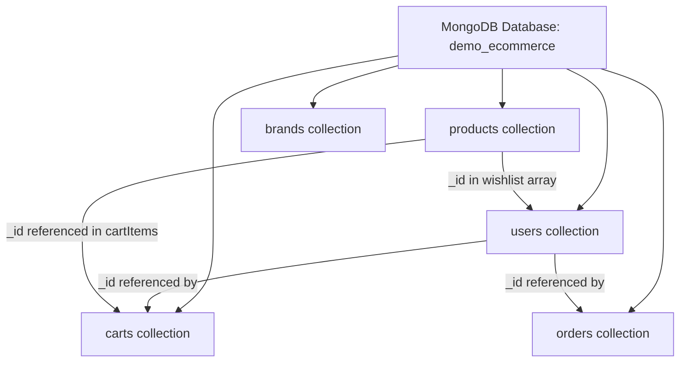

# Chapter 7: MongoDB & Mongoose Fundamentals

## Overview

Your Express API is an HTTP layer. Everything durable — users, products, carts, orders — lives in a database. This project uses **MongoDB**, a document database that stores data as flexible JSON-like documents in collections, and **Mongoose**, the ODM (Object Document Mapper) that gives those documents structure, validation, and a JavaScript API inside Node.js.

Before you build another route or service, you need to understand how data is modeled and connected. MongoDB does not have tables and rows — it has collections and documents. Relationships are not enforced by foreign keys at the database level. You design references and embeddings in your schemas, and Mongoose helps you query and validate them. The choices you make here — embed vs reference, separate collection vs array on a document — shape every feature downstream.

This chapter teaches you to connect this project to MongoDB Atlas, define Mongoose schemas and models, and choose between references and embedded subdocuments using real examples from the e-commerce codebase: `User` with embedded addresses, `Cart` as its own collection, and `Order` snapshots that copy cart line items at checkout time.

## Learning Objectives

After completing this chapter, you will be able to:

1. **Connect** a Node.js application to MongoDB Atlas using Mongoose and an environment-based connection URI.
2. **Define** Mongoose schemas with types, validation, enums, defaults, and timestamps.
3. **Create** Mongoose models and use them in service layers for basic CRUD operations.
4. **Distinguish** when to use ObjectId references versus embedded subdocuments in a schema.
5. **Explain** why this project stores carts and orders as separate collections while wishlists are embedded on the user document.
6. **Configure** schema-level options like `unique`, `required`, and `ref` for data integrity at the persistence layer.

## Prerequisites

### Handbook chapters

- Chapter 1: Project Bootstrap & Runtime Architecture
- Chapter 6: Error Handling & Operational vs Programmer Errors (helpful for Mongoose error remapping discussed later)

### Knowledge

- JavaScript objects and arrays
- Basic JSON structure
- Environment variables (`DB_URI` from Chapter 1)
- HTTP API concepts (resources map to collections/documents)

### Local setup

- MongoDB Atlas account with a cluster created (free tier works)
- `DB_URI` set in `config.env` (connection string format: `mongodb+srv://...`)
- Atlas network access configured (your IP or `0.0.0.0/0` for development)
- `npm install mongoose` (already in project dependencies)
- Server boots with `npm run dev`

### Difficulty

Beginner–Intermediate

## Theory

### MongoDB's document model

MongoDB stores **documents** — BSON objects similar to JSON — grouped in **collections**. There is no fixed schema at the database level. A `products` collection can theoretically hold documents with different fields. In practice, application code enforces structure through Mongoose schemas.

| SQL concept | MongoDB equivalent |
|---|---|
| Database | Database |
| Table | Collection |
| Row | Document |
| Column | Field |
| Primary key | `_id` (ObjectId, auto-generated) |
| JOIN | `$lookup` aggregation or application-level `populate` |
| Foreign key | Reference field (not enforced by DB) |

Each document gets an `_id` field — a 12-byte `ObjectId` that is unique within a collection. APIs expose it as a 24-character hex string: `"507f1f77bcf86cd799439011"`.



### What Mongoose adds

Raw MongoDB driver: write queries by hand, no structure guarantees.

Mongoose adds:

- **Schemas** — define field types, validation, defaults
- **Models** — compiled schema constructors (`User`, `Product`)
- **Middleware** — hooks before/after save, find (Chapter 9)
- **Population** — join-like loading of referenced documents
- **Casting** — convert JS types to BSON types automatically

Pattern in every model file:

```javascript
const schema = new mongoose.Schema({ /* fields */ }, { options });
const Model = mongoose.model("ModelName", schema);
module.exports = Model;
```

`"ModelName"` is the collection name singularized and lowercased — `"User"` → `users` collection.

### Schema definition building blocks

**Types:**

```javascript
name: String,
quantity: Number,
isPaid: Boolean,
expireDate: Date,
role: String,
category: { type: Schema.Types.ObjectId, ref: "Category" },
colors: [String],
cartItems: [{ product: ObjectId, quantity: Number }],
```

**Validation:**

```javascript
email: {
  type: String,
  required: [true, "email is required"],
  unique: true,
  minlength: 3,
  maxlength: 50,
},
quantity: {
  type: Number,
  min: [0, "Quantity cannot be negative"],
  default: 0,
},
```

`required: true` or `required: [true, "message"]` — Mongoose validates on `create()` and `save()`. This is the **last line of defense** after HTTP boundary validation (Chapter 5).

**Enums and defaults:**

```javascript
role: {
  type: String,
  enum: ["user", "admin"],
  default: "user",
},
status: {
  type: String,
  enum: ["pending", "processing", "shipped", "delivered", "cancelled"],
  default: "pending",
},
```

Invalid enum values throw a Mongoose `ValidationError` on save.

**Timestamps:**

```javascript
new Schema({ /* fields */ }, { timestamps: true });
```

Automatically adds `createdAt` and `updatedAt`. Every model in this project uses timestamps.

### References vs embedding

Two ways to relate data in MongoDB:

**Reference** — store ObjectId, document lives in another collection:

```javascript
user: { type: Schema.Types.ObjectId, ref: "User" }
```

- Pro: no data duplication; single source of truth
- Pro: referenced document can be large and updated independently
- Con: requires extra query or `populate()` to load related data
- Con: no referential integrity — orphaned references possible

**Embed** — store subdocument(s) inside the parent document:

```javascript
address: [{
  title: String,
  city: String,
  country: String,
}],
```

- Pro: single read gets parent + children — fast
- Pro: atomic updates on parent document
- Con: document size grows (16MB BSON limit per document)
- Con: duplicated structure if same data needed elsewhere
- Con: updating embedded data across many parents is expensive

| Data in this project | Strategy | Why |
|---|---|---|
| User → addresses | Embed | Always loaded with user; bounded count |
| User → wishlist | Reference array | Product details change; store IDs only |
| Cart → products | Reference in separate collection | Cart is complex, mutable, per-user |
| Order → cartItems | Embed snapshot | Price/quantity frozen at purchase time |
| Product → category | Reference | Category is shared across many products |
| Product → subCategories | Reference array | Many-to-many style |

### Population — loading references

References store IDs only. `populate()` replaces IDs with full documents at query time:

```javascript
const cart = await CartModel.findOne({ user: userId })
  .populate("cartItems.product", "title price");
```

This project's cart model auto-populates on every find:

```javascript
cartSchema.pre(/^find/, function (next) {
  this.populate({ path: "cartItems.product", select: "title price" });
  next();
});
```

Population is not free — it is additional queries under the hood. Use `select` to limit fields.

### Connection lifecycle

```javascript
mongoose.connect(process.env.DB_URI);
```

Returns a Promise. Mongoose maintains a connection pool. One connection per Node.js process — call `connect()` once at startup in `server.js`, not per request.

Connection states (`mongoose.connection.readyState`):

| Value | State |
|---|---|
| 0 | disconnected |
| 1 | connected |
| 2 | connecting |
| 3 | disconnecting |

Production: await connection before accepting HTTP traffic (Chapter 1 production notes).

## Real Project Implementation

### Files in scope

| File | Role |
|---|---|
| `src/database/database.js` | Mongoose connect factory |
| `server.js` | Calls `connectDB()` at startup |
| `src/modules/user/user.model.js` | References + embedded subdocs + pre-save hook |
| `src/modules/cart/cart.model.js` | Separate collection, nested line items, auto-populate |
| `src/modules/coupon/coupon.model.js` | Simple schema — types, unique, timestamps |
| `src/modules/orders/order.model.js` | Order snapshot, enums, references |
| `src/modules/brands/brands.model.js` | Minimal catalog schema + toJSON transform |
| `src/modules/category/category.model.js` | Catalog with unique name |
| `src/modules/subCategory/subCategory.model.js` | Reference to parent category |
| `src/modules/product/product.model.js` | Multiple references, arrays, virtual (preview) |

### How it works in this project

**Step 1 — Set up MongoDB Atlas.**

1. Create a free cluster at [mongodb.com/atlas](https://www.mongodb.com/atlas).
2. Create a database user with read/write password.
3. Whitelist your IP under Network Access.
4. Click Connect → Drivers → copy the connection string.
5. Add to `config.env`:

```env
DB_URI=mongodb+srv://<username>:<password>@cluster0.xxxxx.mongodb.net/demo_ecommerce?retryWrites=true&w=majority
```

Replace `<username>`, `<password>`, and use your database name (`demo_ecommerce` in this project).

**Step 2 — Create the connection module.**

```1:8:nodeJS-ecommerce/src/database/database.js
const mongoose = require("mongoose");
const dotenv = require("dotenv");

dotenv.config({ path: "config.env" });

const connectDB = () => mongoose.connect(process.env.DB_URI);

module.exports = connectDB;
```

Call from `server.js`:

```8:8:nodeJS-ecommerce/server.js
connectDB();
```

**Step 3 — Build a simple model (coupon).**

Start with the simplest model — no references, no hooks. Create `src/modules/coupon/coupon.model.js`:

```6:25:nodeJS-ecommerce/src/modules/coupon/coupon.model.js
const couponSchema = new schema(
  {
    name: {
      type: String,
      required: [true, "Coupon name is required"],
      unique: [true, "Coupon name must be unique"],
    },

    expireDate: {
      type: Date,
      required: [true, "Coupon expire date is required"],
    },

    discount: {
      type: Number,
      required: [true, "Coupon discount is required"],
    },
  },
  { timestamps: true },
);
```

Use in a service:

```javascript
const coupon = await CouponModel.create({
  name: "SAVE20",
  expireDate: new Date("2026-12-31"),
  discount: 20,
});
```

**Step 4 — Build a model with a reference (subcategory → category).**

```18:22:nodeJS-ecommerce/src/modules/subCategory/subCategory.model.js
    category: {
      type: Schema.Types.ObjectId,
      ref: "Category",
      required: [true, "SubCategory must be associated with a category"],
    },
```

`ref: "Category"` tells Mongoose which model to use when you call `.populate("category")`. The database stores only the ObjectId — not the category name.

Product references multiple parents:

```49:64:nodeJS-ecommerce/src/modules/product/product.model.js
    category: {
      type: Schema.Types.ObjectId,
      ref: "Category",
      required: [true, "Product category is required"],
    },
    subCategories: [
      {
        type: Schema.Types.ObjectId,
        ref: "SubCategory",
      },
    ],
    brand: {
      type: Schema.Types.ObjectId,
      ref: "Brand",
      required: [true, "Product brand is required"],
    },
```

**Step 5 — Build a model with embedded subdocuments (user addresses).**

```47:56:nodeJS-ecommerce/src/modules/user/user.model.js
    address: [
      {
        title: String,
        details: String,
        phone: String,
        city: String,
        postalCode: String,
        country: String,
      },
    ],
```

Each address is a subdocument inside the user document. MongoDB assigns each subdocument its own `_id` by default. Updates use positional operators:

```javascript
// Push new address
await UserModel.findByIdAndUpdate(userId, { $push: { address: newAddress } });

// Pull address by subdocument _id
await UserModel.findByIdAndUpdate(userId, { $pull: { address: { _id: addressId } } });
```

This is how `userAddress.service.js` works — no separate `addresses` collection.

**Step 6 — Build a model with reference array (wishlist).**

```40:45:nodeJS-ecommerce/src/modules/user/user.model.js
    wishlist: [
      {
        type: Schema.Types.ObjectId,
        ref: "Product",
      },
    ],
```

Stores product IDs only. Load products with populate:

```javascript
const user = await UserModel.findById(userId).populate("wishlist");
// user.wishlist is an array of full product documents
```

**Step 7 — Separate collection for cart (reference + nested structure).**

Cart is its own collection because it is mutable, queried independently, and cleared after checkout:

```6:35:nodeJS-ecommerce/src/modules/cart/cart.model.js
const cartSchema = new Schema(
  {
    user: {
      type: Schema.Types.ObjectId,
      ref: "User",
      required: true,
    },
    totalPrice: Number,
    totalPriceAfterDiscount: Number,
    cartItems: [
      {
        product: {
          type: Schema.Types.ObjectId,
          ref: "Product",
          required: true,
        },
        quantity: {
          type: Number,
          required: true,
          min: 1,
          default: 1,
        },
        price: {
          type: Number,
          required: true,
        },
      },
    ],
  },
  { timestamps: true },
);
```

`price` on each line item is a **snapshot** — captured when the product was added. If the product price changes later, the cart line keeps the old price until recalculated.

**Step 8 — Order as immutable snapshot.**

Orders copy cart structure but live in a separate collection permanently:

```14:31:nodeJS-ecommerce/src/modules/orders/order.model.js
    cartItems: [
      {
        product: {
          type: Schema.Types.ObjectId,
          ref: "Product",
          required: true,
        },
        quantity: {
          type: Number,
          required: true,
        },
        price: {
          type: Number,
          required: true,
        },

      },
    ],
```

Once created, order line items never change — even if the product is deleted or repriced. The `product` reference is for display (populate title/image); `price` and `quantity` are frozen values.

Order also uses enums for state machines:

```36:49:nodeJS-ecommerce/src/modules/orders/order.model.js
    status: {
      type: String,
      enum: ["pending", "processing", "shipped", "delivered", "cancelled"],
      default: "pending",
    },

    paymentMethod: {
      type: String,
      enum: ["cash", "card"],
      default: "cash",
    },

    isPaid: Boolean,
    paidAt: Date,
```

### Key code

User schema — role enum, embedded addresses, reference wishlist, timestamps:

```33:64:nodeJS-ecommerce/src/modules/user/user.model.js
    role: {
      type: String,
      enum: ["user", "admin"],
      default: "user",
    },

    // child reference
    wishlist: [
      {
        type: Schema.Types.ObjectId,
        ref: "Product",
      },
    ],

    address: [
      {
        title: String,
        details: String,
        phone: String,
        city: String,
        postalCode: String,
        country: String,
      },
    ],

    resetCode: String,
    resetCodeExpiredTime: Date,
    resetCodeIsVerified: Boolean,
  },

  { timestamps: true },
);
```

Brand schema — typical catalog model shape:

```6:22:nodeJS-ecommerce/src/modules/brands/brands.model.js
const brandSchema = new Schema(
  {
    name: {
      type: String,
      required: [true, "Brand name is required"],
      unique: true,
      minlength: [3, "Brand name must be at least 3 characters long"],
      maxlength: [50, "Brand name must be less than 50 characters long"],
    },
    slug: {
      type: String,
      minlength: [3, "Slug must be at least 3 characters long"],
    },
    image: String,
  },
  { timestamps: true },
);
```

### Deviations in this codebase

- **`connectDB()` not awaited** — server listens before connection confirmed (Chapter 1).
- **No unique index on `cart.user`** — theoretically two cart documents per user possible; service logic assumes one.
- **Unused import in `user.model.js`** — `const { ref } = require("process")` is dead code.
- **Unused import in `order.model.js`** — `const { type } = require("os")` is dead code.
- **`lowerCase: true` on user slug** — not valid Mongoose schema type option (should be `lowercase: true`); silently ignored.
- **No `ref` integrity** — deleting a category does not cascade to products; orphaned references possible.
- **Wishlist on User vs Cart collection** — inconsistent patterns for user-product relationships (intentional but worth documenting).

## Best Practices

1. **One model file per collection** — `*.model.js` in each module folder. *In this project: follows.*

2. **Use `timestamps: true` on all schemas** — audit trail for free. *In this project: follows.*

3. **Store connection URI in environment variables** — never hardcode credentials. *In this project: follows.*

4. **Use `enum` for fixed value sets** — role, order status, payment method. *In this project: follows.*

5. **Snapshot prices on cart and order line items** — never rely on live product price for historical records. *In this project: follows.*

6. **Use `unique: true` on natural keys** — email, coupon name, brand name. *In this project: follows; ensure indexes exist in Atlas.*

7. **Choose embed for bounded one-to-few, reference for shared or unbounded data** — addresses embed, products reference. *In this project: follows.*

8. **Validate at HTTP boundary AND schema** — defense in depth. *In this project: partial — schemas have validation; not all HTTP inputs validated.*

## Common Mistakes

1. **Calling `mongoose.connect()` per request** — exhausts connections. **Fix:** Connect once at startup. *This project connects once in server.js.*

2. **Storing referenced document data instead of ObjectId** — duplicating product title in cart without snapshot reason. **Fix:** Store `ObjectId` + snapshot fields you need frozen (price). *Cart does this correctly.*

3. **Embedding unbounded arrays** — embedding every order inside user document. **Fix:** Separate `orders` collection. *This project uses separate collection.*

4. **Forgetting `ref` on ObjectId fields** — `populate()` fails silently or errors. **Fix:** Always set `ref: "ModelName"` when you plan to populate.

5. **Relying only on Mongoose validation for security** — schema validates on save, not on malicious HTTP input shape. **Fix:** Boundary validation first (Chapter 5), schema second.

6. **Not handling CastError** — invalid ObjectId in `findById("abc")` throws. **Fix:** Validate params as `isMongoId()` or remap in global handler (Chapter 6).

## Production Notes

### Configuration

- **Connection string options** — `retryWrites=true&w=majority` in Atlas URI ensures write durability. Add `maxPoolSize=10` for connection pool tuning under load.
- **Separate databases per environment** — `demo_ecommerce_dev`, `demo_ecommerce_prod`. Never point development at production data.
- **Read preference** — for read-heavy catalog, configure secondary reads from Atlas replica set (advanced).

### Security & reliability

- **Atlas IP whitelist** — restrict to server IPs in production; avoid `0.0.0.0/0`.
- **Database user permissions** — application user gets read/write on app database only, not admin.
- **Rotate credentials** — if `DB_URI` was ever committed, rotate password in Atlas and update env vars.
- **Indexes** — `unique: true` in schema creates indexes on deploy but verify in Atlas UI. Add compound indexes for frequent queries (`{ user: 1 }` on carts).
- **Backup** — enable Atlas continuous backup for production clusters.

### What this project is missing

- `await connectDB()` with failure handling before `app.listen()`
- Unique index on `cart.user` (one cart per user enforced at DB level)
- Cascade strategy for deleted referenced documents
- Explicit index definitions beyond `unique` fields
- Connection event logging (`mongoose.connection.on("error", ...)`)
- Read-only database user for reporting queries
- Migration tooling for schema changes

## Senior Engineer Notes

**Why MongoDB for e-commerce learning projects.** Flexible schema suits evolving product attributes (colors, images, nested variants). Document model maps naturally to JSON APIs. Trade-off: no JOIN, no enforced FK — relational integrity is application responsibility. At scale, product catalog + order history fits document model well; financial reporting often needs a relational warehouse.

**Trade-off: wishlist embedded as ID array vs separate collection.** Current design — array of ObjectIds on User — is correct for a simple wishlist. If wishlist items need metadata (added date, notes), embed subdocuments `{ product: ObjectId, addedAt: Date }` instead of bare IDs. Separate `wishlists` collection only if wishlists become shared or exceed document size concerns.

**Trade-off: cart as separate collection.** Correct. Carts are high-churn, cleared on checkout, and need independent queries. Embedding cart in User would bloat user documents and complicate concurrent updates.

**When to break document modeling rules.** Multi-document ACID transactions (MongoDB 4.0+) for inventory decrement + order create — this project uses `bulkWrite` without transaction wrapper. At scale with concurrent purchases, wrap in `mongoose.startSession()` + transaction (Chapter 20).

**Refactoring direction for this codebase.**

1. Add unique sparse index: `cartSchema.index({ user: 1 }, { unique: true })`.
2. Remove dead imports in `user.model.js` and `order.model.js`.
3. Fix `lowerCase` → `lowercase` on user slug field.
4. Add connection event handlers in `database.js`.
5. Document embed vs reference decisions in a schema ADR or README for onboarding.

**Scale considerations.** Embedded addresses on user are fine to ~100 addresses per user. Reference arrays (wishlist) grow unbounded — cap or paginate. `populate()` on every cart find adds N+1 queries — acceptable at low scale; use aggregation `$lookup` or denormalize at high scale. ObjectId indexes on `user`, `category`, `product` fields are mandatory before production traffic.

## Interview Questions

### Conceptual

1. **Q:** What is the difference between embedding and referencing in MongoDB schema design?
   **A:**
   - Embed: subdocuments live inside parent document
   - Reference: store ObjectId pointing to another collection
   - Embed: single read, atomic updates, size limits
   - Reference: no duplication, needs populate/extra query
   - Choose embed for bounded one-to-few; reference for shared or many

2. **Q:** What does Mongoose `ref` do on an ObjectId field?
   **A:**
   - Names the target model for `populate()`
   - Does not enforce foreign key at database level
   - Stores only ObjectId in MongoDB
   - `populate("category")` replaces ID with full Category document
   - Required for join-like behavior in Mongoose

3. **Q:** Why does this project snapshot `price` on cart and order line items instead of reading live product price?
   **A:**
   - Product price can change after item added to cart
   - Order is legal/financial record — must reflect price at purchase
   - Live price would make historical orders incorrect
   - Snapshot: copy price at add-to-cart and at checkout
   - Reference to product ID still allows display of current title/image

### Applied

4. **Q:** Design the Mongoose schema for a `notifications` collection — user receives notifications with title, body, read flag.
   **A:**
   - Separate collection (unbounded per user)
   - `user: { type: ObjectId, ref: "User", required: true }`
   - `title: String, body: String, read: { type: Boolean, default: false }`
   - `timestamps: true`
   - Index on `{ user: 1, createdAt: -1 }` for listing
   - Not embedded — notification count grows without bound

5. **Q:** Two cart documents exist for the same user. How could this happen in this project and how do you prevent it?
   **A:**
   - No unique index on `cart.user`
   - Race condition: two simultaneous `POST /cart` both find no cart, both create
   - Fix: `cartSchema.index({ user: 1 }, { unique: true })`
   - Fix: use `findOneAndUpdate` with `upsert: true` in service
   - Query always uses `findOne({ user })` — assumes one but does not enforce

6. **Q:** `mongoose.connect()` fails at startup but the server still listens. What is wrong and how do you fix it?
   **A:**
   - `connectDB()` called without `await` in server.js
   - Connection failure becomes unhandled rejection or silent buffer
   - Fix: `async function start() { await mongoose.connect(...); app.listen(...); }`
   - Exit process on connection failure
   - Log `mongoose.connection.on("error")` and `"connected"` events

## Exercises

### Exercise 1 — Guided

**Goal:** Map the data model relationships by reading model files only.

**Constraints:** Read `user.model.js`, `cart.model.js`, `order.model.js`, `product.model.js`, `subCategory.model.js`. No code changes.

**Success criteria:**
1. Draw or list which collections reference which (User → Cart → Product, etc.).
2. Identify every embedded subdocument vs ObjectId reference in the user schema.
3. Explain why orders copy `cartItems` instead of referencing the cart document.
4. List all enum fields across the five files.

### Exercise 2 — Implement

**Goal:** Create a `notifications` model and wire basic create/read in a new module skeleton.

**Constraints:** Create `src/modules/notifications/notifications.model.js` only (no routes required). Follow project conventions.

**Success criteria:**
1. Fields: `user` (ref User), `title`, `body`, `read` (default false).
2. `timestamps: true`.
3. Index on `{ user: 1, createdAt: -1 }` defined in schema.
4. Export `NotificationModel`.
5. Test in Node REPL or a one-line script: `NotificationModel.create({...})` succeeds when DB is connected.

### Exercise 3 — Challenge

**Goal:** Harden the database layer for production readiness.

**Constraints:** Modify `database.js`, `cart.model.js` only. May update `server.js` if needed for await.

**Success criteria:**
1. `connectDB()` returns the connection promise and logs "MongoDB connected" on success.
2. `server.js` awaits `connectDB()` before `app.listen()`; exits on failure.
3. Unique index on `cart.user` — only one cart per user at database level.
4. `mongoose.connection.on("error", ...)` logs connection errors.
5. Attempting to create a second cart for the same user throws duplicate key error (11000).

## Summary

### Key takeaways

- MongoDB stores flexible documents in collections; Mongoose adds schemas, validation, and models on top.
- Connect once at startup via `mongoose.connect(process.env.DB_URI)` — never per request.
- Schemas define types, validation, enums, defaults, and `timestamps` — every model in this project uses them.
- Reference (ObjectId + `ref`) for shared or unbounded relationships; embed for bounded subdocuments owned by parent.
- Cart and orders are separate collections with price snapshots; addresses embed in user; wishlist stores product ID array.
- Schema validation complements but does not replace HTTP boundary validation.
- This project's connection is fire-and-forget — await and enforce unique cart per user before production.

### Files to remember

`src/database/database.js`, `server.js`, `src/modules/user/user.model.js`, `src/modules/cart/cart.model.js`, `src/modules/orders/order.model.js`, `src/modules/product/product.model.js`, `src/modules/coupon/coupon.model.js`

You can define individual schemas — next you will see how they connect into a full e-commerce domain model with taxonomy, snapshots, and stock fields.

## Next Chapter Preview

**Next:** Chapter 8 — Schema Design for E-Commerce Domains

Chapter 7 gave you Mongoose primitives. Chapter 8 zooms out to the full entity graph: how categories, subcategories, brands, products, carts, and orders relate across collections, why orders snapshot cart data, and how stock fields (`quantity`, `sold`) support inventory management at checkout. You will design schemas by business rule, not just by syntax.
